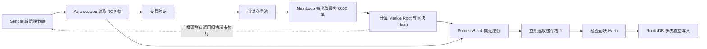

# Chain 代码审查与实时性改进报告

审查日期：2026-09-08。目标目录：`D:\Project\Chain`。

**结论：这是一个以 C++20、Boost.Asio 协程、固定长度二进制交易、Merkle 树和 RocksDB 为基础的区块链实验原型。已有收交易、构造区块和本地存储的基础代码，但交易正确性、消息协议、多节点一致性和重启恢复仍有关键缺口。下一步应先打通可信的交易到确认流程，再优化延迟。**

本次只审查并生成文档，没有修改业务源码。审查对象是当前工作区，包括已有未提交修改，而不只是 Git HEAD。基准提交为 `1ad2b6c3f589e4a9adddc62c38c246ae817188b0`；审查开始时 `Crypto/MerkleTree.h`、`Message/Message.h`、`Network/Client.h`、`Network/Server.h`、`Time/Time.h` 已有修改。源码位置以下使用相对于目标目录的文件名和一基行号。

配套文件：`NEXT_STEPS_2026-09-08.md` 给出可直接执行的任务及验收条件；`REVIEW_EVIDENCE_2026-09-08.txt` 保存构建记录、复现结果、探针源码和源码摘要。

## 1. 核心思想与框架

### 1.1 技术栈

| 层次 | 代码使用的技术 | 实际作用与当前状态 |
| --- | --- | --- |
| 语言与构建 | C++20、CMake、MinGW/UCRT、Ninja | 使用协程、`array`、`span`、标准线程与互斥锁；依赖路径主要硬编码为本机 D 盘 |
| 网络 | Boost.Asio、TCP、`awaitable`、`co_spawn` | 收发采用异步 I/O；`Peer` 的发送队列由 strand 串行处理 |
| 编码 | `memcpy` 手工二进制编码 | 消息约定为 1 字节类型、4 字节载荷长度、载荷；目前多处实现不一致 |
| 密码学 | libsodium | 交易/区块使用 32 字节 BLAKE2b 摘要，交易签名为 Ed25519；另有独立 VRF 实验 |
| 交易池 | `unordered_map<hash, tx>` 与 `mutex` | 按交易自带 Hash 去重，固定交易长度 176 字节 |
| 区块组织 | 前块 Hash、Merkle Root、高度、交易数 | Merkle 树奇数层复制最后一个叶子，空列表返回零根 |
| 存储 | RocksDB | 保存区块、交易、高度索引、当前高度和链头；尚无账户状态机 |
| 配置与观测 | yaml-cpp、spdlog、Remotery | YAML 配置节点；日志输出及局部 CPU 采样；没有端到端延迟指标 |
| JSON | nlohmann/json 头文件 | 有引入，当前主要网络路径实际使用二进制编码 |

这是一套自行组织的 C++ 节点原型，未看到基于 Ethereum、Substrate 或其他完整链框架的实现，也未看到智能合约虚拟机、完整账本状态执行、经济模型或正式共识模块。

### 1.2 模块职责

| 文件/目录 | 职责 | 关键入口 |
| --- | --- | --- |
| `main.cpp` | 初始化、监听、I/O 线程、出块线程 | `main` |
| `Network/Server.h` | 接受连接、读取帧、按类型分派 | `Listen`、`session` |
| `Network/Client.h` | Peer 池、发送队列、广播、发现、同步、打包循环 | `SendData`、`Connect`、`MainLoop` |
| `Transaction/Transaction.h` | 交易生成、编解码、验证、入池 | `GenerateTx`、`VerifyTransaction`、`ProcessTx` |
| `Transaction/Block.h` | 区块编解码、Merkle 与 Hash 验证、候选块缓存 | `GenerateBlock`、`VerifyBlock`、`ProcessBlock` |
| `Message/Message.h` | 各种消息的二进制封装 | `GenerateNewBlockMessage` 等 |
| `DB/DB.h` | RocksDB 访问及元数据 | `InitDB`、`DBWriteBlockALL` 等 |
| `Key/Key.h` | 临时钱包密钥生成 | `GenerateWallet`、`InitWallet` |
| `Time/Time.h` | 时间戳、共振偏差数据 | `GetTime`、`InitTime` |
| `Crypto/VRF.h` | 基于 Ed25519 群操作的自定义 VRF 实验 | `VRFGen`、`VRFVerify` |
| `Sender/Sender.cpp` | 本机交易发生器 | 连接 `127.0.0.1:8089` 并发送交易 |
| `Test.cpp`、`Test/`、`Crypto/CryptoTest.cpp` | 学习示例、占位测试、密码运算基准 | 目前不构成自动化链行为测试集 |

`Network/Client.h` 同时承担网络、时间协调、共识选择和数据库提交，职责过多。多个头文件还直接定义全局变量及非 inline 函数；单个可执行目标主要依靠一个翻译单元暂时避开了多翻译单元的重复定义问题。模块拆分时应同时整理 `.h/.cpp` 和对象所有权。

### 1.3 数据模型

交易的布局为：

```text
sender[32] | receiver[32] | amount[8] | nonce[8] | hash[32] | signature[64]
<------------------- 80 字节 ----------------->
总计 176 字节
```

生成交易时，先对前 80 字节求 BLAKE2b 摘要，再对摘要签名。这个设计要求验证方重新计算摘要；当前验证实现遗漏了这一步。

区块的布局为：

```text
previousHash[32] | merkleRoot[32] | height[8] | txNum[8] | hash[32] | txs[176 × N]
<------------------------- 80 字节 ------------------->
固定部分共 112 字节，总长度为 112 + 176 × N
```

整数目前按宿主机内存字节序编码。协议需要规定固定端序、版本和链标识，避免跨平台差异及跨链重放。交易、区块、投票各自的签名/Hash 输入也需要明确用途标识。

### 1.4 当前主流程及设计意图



设计意图是：各节点收集交易，自行提出候选块；同一高度选择交易更多的块，数量相同选择 Hash 更小的块；用三个缓存槽容纳当前及未来两轮候选，通过时间偏差调整节拍，使多个节点趋向同一出块节奏。

但实际代码在 `ProcessBlock(data)` 后立刻选择并写入缓存槽 0，500ms 等待发生在提交之后，不是先等待全网候选收齐。`MainLoop` 中的广播返回值被丢弃，也没有正式投票与提交证明。因而目前“本地打印 Confirmed”只代表本地提交路径执行，不代表全网最终确认。

`main.cpp:77–93` 实际启动监听、I/O 工作线程及 `MainLoop`；`ConnectSeed` 被注释。节点发现、批量交易分享、区块同步没有接入主启动流程。VRF 也没有接入提议者选择或区块验证。

## 2. 审查发现：应先修复的问题

优先级解释：P0 为当前可导致非法数据被接受、内存破坏或链头错误的问题；P1 为多节点可用性、一致性、恢复和资源控制问题；P2 为后续工程与性能改进。下面区分已运行复现和静态分析。

### R01 / P0：交易验签未绑定交易内容，区块也没有拒绝无效签名

位置：`Transaction/Transaction.h:87–95`；`Transaction/Block.h:115–127`。

- `VerifyTransaction` 只验证交易自带的 32 字节 Hash 的签名，没有重新计算前 80 字节的 Hash。因此保留发送者、Hash 和签名，修改接收者、金额或 nonce，仍可通过验证。同一 Hash 的修改后交易还可以覆盖交易池内原交易。
- `VerifyBlock` 发现交易验签失败只写日志，随后仍可能返回 true。
- Merkle Root 的叶子使用交易自带 Hash，所以它不能弥补缺失的内容摘要检查。

**运行复现：修改金额后 `VerifyTransaction` 仍返回 true；包含无效签名交易的区块 `VerifyBlock` 仍返回 true。**

修复：规范化交易编码 → 重算并比较摘要 → 验签 → 状态规则验证；任何一笔交易失败都应拒绝区块。网络单笔交易、批量交易、区块验证和历史同步必须共用验证规则。libsodium 的 detached API 只验证传入的消息，本项目传入的是摘要，因此调用方必须保证该摘要对应交易内容。[libsodium 签名文档](https://libsodium.gitbook.io/doc/public-key_cryptography/public-key_signatures)

### R02 / P0：批量交易漏处理且绕过验证

位置：`Transaction/Transaction.h:122–135`。

`ProcessTxPackage` 的循环没有推进 `offset`，每次都读取第一笔；同时没有调用交易验证，也未要求包长度是 176 的整数倍。

**运行复现：两笔不同交易的包只入池第一笔；无效签名交易可以通过此入口入池。**

修复：先验证包长度、条数和资源上限，逐笔推进偏移；在锁外完成密码验证，在锁内短时间去重和入池。不能在持有全局交易池锁时执行大量验签。

### R03 / P0：网络与区块解析缺少边界检查

位置：`Network/Server.h:49–56,87–114,134–145`；`Transaction/Block.h:46–60`。

网络直接按不可信 `uint32_t size` 分配内存；区块解析直接读取固定字段，再按不可信 `txNum` 扩容与拷贝。缺少最小长度、最大长度、交易数、整数溢出及精确长度检查。高度、时间及同步响应等分支也直接读取固定偏移。消息体 `async_read` 后没有先处理错误再分派。

结果可能是巨额分配、越界读取、处理截断消息或节点退出。本次未向原节点发送畸形消息；结论来自静态检查。

建议先验证 `size >= 112`，再检查 `txNum <= max_txs`、`txNum <= (size-112)/176`、精确匹配 `size == 112+176*txNum`，避免先执行可能溢出的乘法。各消息类型在读取消息体之前应校验长度范围，并设置读超时及每连接资源预算。

### R04 / P0：多处确定的越界写入或缺失返回值

| 位置 | 问题 | 影响 |
| --- | --- | --- |
| `Network/Client.h:48,116` | `memcpy(&key+4, &port, 2)` 按 `uint64_t*` 移动了 32 字节 | 在局部变量外写入；不是向 key 的第 4 字节写端口 |
| `Transaction/Block.h:171` | 相同交易数分支访问 `BlockBuffer[block.height]` | 数组只有 3 项，高度大于等于 3 时可越界；高度 2 时也不是期望槽位 |
| `Message/Message.h:27–39` | 高度消息分配 8 字节却写入 13 字节，且未 return | 越界写入与未定义行为；作为广播参数仍会先被求值 |
| `Network/Client.h:175–196` | 发现消息仅分配 `6 × peers`，实际写入 `5+6 × peers` | 即使 peer 数量为零也会写空缓冲区 |
| `Network/Client.h:147–158` | `QueryHeight/QueryBlock` 声明返回 awaitable，但无 co_await/co_return，也没有普通 return | 它们当前并非真正的协程函数，执行到末尾属于未定义行为 |

编译器已经对 `AddPeer` 的越界写、多个缺失返回值给出警告。应先将这些警告修至零，再继续多节点验证。

### R05 / P1：发送与接收双方的消息协议不一致

接收端把长度字段解释为“载荷长度”，而多个构造函数写入总长度、错误常量或损坏字段。

| 消息 | 证据 | 具体问题 |
| --- | --- | --- |
| 新区块 | `Message/Message.h:14–25` | length 写为 `payload+5`，接收端会多等 5 字节或读入下一帧；已运行复现 |
| 高度查询/响应 | `Network/Client.h:147–150`、`Network/Server.h:78–84` | 请求只有类型字节，响应只有高度，均不符合完整 5 字节帧头 |
| 区块查询 | `Network/Client.h:151–157` | 区块号从偏移 0 写入，覆盖 type，且没有规范 length |
| 区块响应 | `Message/Message.h:40–58`、`Network/Server.h:107–114` | 发送方在载荷前加 blockNum，接收方却当作区块头；length 又使用总长度 |
| 批量交易 | `Network/Client.h:215–238` | length 固定 64，写完 length 后 offset 没加 4，交易覆盖 length |
| 时间 ACK | `Message/Message.h:75–91` | 应为 16 字节载荷，却写 length=64；offset 未推进；复制的是 vector 对象本身而非 `.data()` |

修复方式是建立唯一的 `EncodeFrame(type, payload)` 和有界 `DecodeFrame`，而不是继续逐个手工拼接。冻结类型表，定义协议版本、端序和每种载荷结构，并为每种消息做往返和流式拆包测试。

### R06 / P1：协程未调度、连接路径持锁与读循环缺失

位置：`Network/Client.h:93–102,117–128,199–212,324,366`；`Network/Server.h:123,169–176`。

- `BroadcastData` 是真正的协程，普通调用后丢弃 awaitable 不会运行函数体。两处 `MainLoop` 广播均如此。
- 服务器调用 `ProcessDiscoverMessage(message)` 后丢弃 awaitable；其内部两参数 `co_spawn` 在本地 Boost 1.91 中又返回未启动的 deferred 操作，编译器已明确警告。
- `Connect` 持有 `peerMutex` 跨越异步连接和发送；随后调用再次获取同一 mutex 的 `AddPeer`。路径修复后也会遇到重入死锁，跨线程恢复还涉及 mutex 所有权问题。
- 主动连接成功后没有启动对应的 `session` 接收循环；仅 `AddPeer` 不足以收消息。
- `Listen` 在接受下一个连接前先等待当前连接发握手字节，缺少超时，单个不发握手的连接就能拖住接受循环。
- Peer 去重键当前实际没有正确包含端口，重复时 `AddPeer` 可能返回空指针，但调用方未处理。

修复：明确同步函数与协程的边界；后台任务用显式 `co_spawn(executor, task, completion_handler)`，需要结果的调用用 `co_await`；禁止普通 mutex 跨 `co_await`；握手移入独立 session 并设置超时；连接两端均启动读循环。实际本地 Asio 源码 `impl/awaitable.hpp:121–123` 的 `initial_suspend()` 返回 `suspend_always()`，也与官方协程用法一致。[Boost.Asio 协程文档](https://www.boost.org/latest/doc/html/boost_asio/overview/composition/cpp20_coroutines.html)

### R07 / P0：出块状态存在数据竞争，候选缓存推进不完整

位置：`Transaction/Block.h:69,165–174`；`Network/Client.h:328–334`；`Network/Server.h:144`。

`GenerateBlock` 在锁外访问交易池大小；`ProcessBlock` 无锁读写 `epoch/BlockBuffer`，而 `MainLoop` 在另一个线程推进它们。只在读取一侧加锁不能保护另一侧未加锁的写入。`endTime`、Peer 时间字段也跨线程访问，缺少统一所有者。socket 的读、关闭与发送也没有全部落在同一个 Peer strand。

缓存移动后没有清空最后一项；epoch 在验证前块和成功提交之前就递增。若没有本地交易，`MainLoop` 直接 continue，即使已经收到候选块，也可能不推进确认。

建议用一个链状态 strand/事件循环独占高度、候选块、投票和内存账本；Peer strand 独占连接生命周期；CPU 验证任务仅返回结果。这样更容易同时控制数据竞争和尾延迟。

### R08 / P0：启动重置链头，存储读取和历史同步不完整

位置：`main.cpp:86`；`Transaction/Block.h:131–146`；`DB/DB.h:20–23,55–85`；`Network/Server.h:107–114`。

- 每次启动无条件生成创世块，并覆盖 `CurrentBlock` 与 `BlockHeight=1`。已有块不会全部删除，但正常链头会被重置；全局 epoch 又从 2 开始。
- 高度索引写的是 `height → hash`，`DBReadBlockByHeight` 却直接把这个 Hash 当成区块返回，没有第二次查询 `hash → block`。
- `DB::Open/Get/Put` 状态未检查；找不到高度时 `stoi("")` 会抛异常，读取不存在的链头时也没有校验 32 字节长度。高度类型为 uint64_t，却用范围更小的 `stoi`。
- type=7 同步响应未经过正常区块验证就直接写库；同步逻辑没有可靠的请求关联、等待响应、逐高验证、重试及链头推进，`peerPool[0]` 也可能插入空 Peer。

**运行复现：按高度读区块只得到 32 字节 Hash；在隔离数据库中写入高度 2 后再调用创世块生成，高度回到 1、链头改变。**

修复：仅在明确的新数据库中初始化 genesis，已有数据库先恢复并校验链头；所有读取返回显式错误；同步通过与在线提议相同的验证和提交入口。仓库原有 `run.err` 含 `stoi` 异常，但这是历史记录，不能作为本次端到端运行结果。

### R09 / P1：区块提交不是原子操作，交易过早从池中移除

位置：`Network/Client.h:338–350`；`DB/DB.h:26–27,38–44`；`Transaction/Block.h:76–81`。

一块包含 N 笔交易时，当前至少产生 N+4 次独立 Put：高度、链头、块体、高度索引和 N 笔交易。进程在中间失败可留下元数据与块体不一致的状态。`Put` 使用默认 WriteOptions，调用是同步执行的，但没有启用强制持久化同步；“C++ 调用阻塞”和“已经刷到稳定存储”是两回事。

生成候选块时立即 erase 交易。如果候选未提交、选中了其他块或存储失败，没有可靠的恢复入池路径。

修复：把区块、索引、状态变化、当前高度和 Hash 放入一个 WriteBatch 原子提交；错误向上传递。交易可在提议时标记 reserved，只有确认提交成功才删除，失败或换轮释放。明确最终确认需要的 WAL/持久化策略，并将其延迟计入指标。RocksDB 官方说明 WriteBatch 同时提供原子更新和批量写入能力；`sync=true` 与默认写入的持久化承诺不同。[RocksDB Basic Operations](https://github.com/facebook/rocksdb/wiki/Basic-Operations)

### R10 / P1：目前的候选比较规则没有提供分布式最终性

位置：`Transaction/Block.h:168–174`；`Network/Client.h:294–367`。

“交易更多优先、数量相同取较小 Hash”只定义候选排序，不保证不同节点看到相同候选集合。两个诚实节点可能各自只看到 A、B，然后在同一高度分别落库；各自的 previousHash 检查都能通过。时间同步无法证明多数节点接受同一块。当前也没有验证者集合、提议签名、投票、法定人数证明、锁定规则、换轮和分叉恢复。

同一组交易的不同排列还会产生不同 Merkle Root；按 Hash 竞争可能鼓励反复调整排列。原型目前也没有实现限制这种竞争的协议。

应先明确威胁模型再选共识。若采用 BFT，必须实现或集成完整的投票、锁定和换轮规则，不能仅增加一个“收集若干签名”的判断。共识设计建议见第 4 节。

### R11 / P1：时间同步量纲及语义错误，忙等浪费 CPU

位置：`Time/Time.h:18–21,46–50`；`Network/Client.h:241–248,263,299–313,352–363`。

- 主入口没有调用 `InitTime`。`GetTime` 只读全局 `localTime`，不会刷新；即使初始化也只会发固定时间。未初始化返回零已运行复现。
- 发出值按纳秒编码，接收方按毫秒构造 time_point；又对原始 duration 的 `.count()` 直接套 milliseconds，存在再次错用计数单位。
- `(T2-T1+T3-T4)/2` 是时钟偏移估计，被保存为 `lag` 后当作网络延迟使用。
- `T1` 记录在入发送队列之后，不等于真正发出时刻；没有请求 ID，多个请求可能错配。
- 共振样本只保存高度与偏差，没有按验证者身份限制每轮样本数量；平均偏差缺少异常值过滤和调整上限。
- `while (steady_clock::now() < endTime) {}` 持续忙等；另有 10ms 轮询等待和不断累计 bias，可能增加调度抖动或长期偏移。

标准四时间戳方法区分 `offset=((T2-T1)+(T3-T4))/2` 和 `RTT=(T4-T1)-(T3-T2)`；单向延迟还需要额外假设。计时用单调时钟，跨节点时间戳规定统一格式；时间偏差应只辅助超时估计，不能作为提交凭证。[RFC 5905 §8](https://www.rfc-editor.org/rfc/rfc5905.html#section-8)

### R12 / P1：缺少账本状态、身份及资源边界

位置：`Transaction/Transaction.h:15–22,87–118`；`Key/Key.h:23–24`；`Network/Client.h:29–35`；`Network/Server.h:54–56`。

当前没有账户余额、已执行 nonce、双花/重放检查、确定性执行或状态根。交易中虽然有 amount 和 nonce，存储交易本身不等于执行转账。钱包每次启动重新生成，配置中的 id/name 没有形成认证节点身份。交易池、Peer 发送队列和连接数也缺少明确上限。

下一步至少需确定账户或 UTXO 模型、创世状态、签名域、持久身份、状态执行与失败交易规则；设置有界队列、每 Peer 配额、超时和拒绝策略。否则负载升高时会表现为队列持续增长，平均 TPS 尚可而 P99 延迟失控。

### R13 / P2：VRF 属于独立密码学实验，不能当作已完成的共识组件

位置：`Crypto/VRF.h:20–155`；`Crypto/CryptoTest.cpp:25–74`。

代码实现了曲线映射、证明和输出验证，但未接入主链。验证函数没有先检查证明长度，多处曲线运算错误返回被忽略；基点初始化依赖调用 `InitVRFWallet`；密码基准入口也没有显式调用 `sodium_init`。自生成证明能验证或跑出 TPS，并不等于符合标准或完成安全审计。

若未来需要随机提议者，优先选定标准套件、独立验证上下文、官方测试向量和经过审查的实现，再设计随机种子来源与抗操纵规则。VRF 可辅助选择提议者，但不能替代共识确认。[RFC 9381](https://www.rfc-editor.org/rfc/rfc9381.html)

## 3. 下一步必须补齐的能力

1. **可信交易入口**：统一编解码、重算摘要、验签和防重放，所有入口使用同一验证策略。
2. **可恢复的本地账本**：账户/UTXO 状态、确定性执行、状态根、原子提交、重启恢复。
3. **可用的双向网络**：完整帧、Peer 生命周期、主动连接接收、请求响应与同步。
4. **有定义的共识与最终性**：验证者与故障模型、提议者、轮次、锁定、投票、提交证据、故障后恢复。
5. **交易状态查询/订阅**：已接收、已验证、已提议、已最终确认、被拒绝/过期的明确含义。
6. **自动化验证与延迟基线**：负例、恢复、多节点分区、限流、端到端 P50/P95/P99。

任务依赖和完成标准见 `NEXT_STEPS_2026-09-08.md`。不建议现在优先做自定义哈希表、DAG、分片或进一步自写密码学原语。

## 4. 如何提高实时性

### 4.1 先定义要变快的指标

建议区分三种延迟：

| 指标 | 起点和终点 | 使用者能得到的承诺 |
| --- | --- | --- |
| 接收反馈延迟 | 客户端提交 → 接口返回 txid/明确错误 | 节点已经接收请求；若仅在内存队列中，应明确还不是持久确认 |
| 验证/入块延迟 | 客户端提交 → 完整验证或被包含于提议 | 可展示 pending/validated/proposed；仍可能被拒绝或换轮 |
| 最终确认延迟 | 客户端提交 → 共识提交条件满足，按约定持久化并可查询 | 可向业务承诺协议定义下的最终结果 |

端到端延迟应分解为：网络传输、入口排队、验证、等待打包、提议传播、投票/共识、提交持久化、结果通知。优化某一步只在它位于瓶颈路径时才会明显改善结果。

当前每轮名义上先等待约 100ms，再设置约 500ms 的周期目标；这不是可靠的 500ms 最终确认 SLA，也不是已验证的吞吐数据。空池后额外 sleep(500ms) 让刚到的交易继续等待。满块大小为 `112+6000×176=1,056,112` 字节，约 1.01 MiB，还不含外层帧与 TCP/IP 开销；每个 Peer 都发送一份会增加网络压力。

### 4.2 共识路线应按信任模型选择

| 实际场景 | 适合评估的路线 | 前提和取舍 |
| --- | --- | --- |
| 单机学习或中心化排序服务 | 单提议者 + 有序日志 | 最容易测出本地处理延迟；其确认承诺由该服务提供 |
| 节点都受同一管理方控制，主要考虑掉线/崩溃 | 成熟 Raft 实现 | 多数副本可用时继续推进；不提供恶意节点模型下的 BFT 保证 |
| 多机构联盟链、固定或受控验证者、需容忍恶意节点 | 成熟 BFT 实现，或按完整协议实现固定验证者版本 | 需要提议、投票、锁定、换轮、签名及持久防双签；最终性由协议证据决定 |
| 开放公链 | 有安全论证及部署经验的完整协议栈 | 还需抗女巫、验证者准入/权益、经济与网络攻击模型；当前代码与之有较大距离 |

Raft 的故障模型、选举与日志安全机制见[原始论文](https://raft.github.io/raft.pdf)。BFT 可以参考 CometBFT 的 `Propose → Prevote → Precommit → Commit`、锁定与换轮规范；少于三分之一恶意投票权、适当网络条件等前提下讨论安全和活性，提交需要超过三分之二的相关投票权，不能把门槛和轮次规则拆开使用。[CometBFT 共识规范](https://github.com/cometbft/cometbft/blob/main/spec/consensus/consensus.md)

**对当前原型的建议：先以固定验证者、局域网、小规模测试网为工作假设，补齐账本和网络；之后根据是否需要容忍恶意节点选择 Raft 或完整 BFT。**若选择 BFT，可先用 4 个等权验证者验证正常路径及 1 个故障节点场景。时间同步仍可用来辅助观测和超时配置，但不负责判断一个块是否最终提交。

### 4.3 推荐的处理结构


- 网络线程负责收帧、限额和分派，不长时间执行验签或数据库操作。
- 独立交易的 Hash/签名验证可以并行；余额与 nonce 的执行必须遵循确定的区块顺序及依赖，不能任意并行扣款。
- 链状态单一所有者避免在热路径上到处加全局锁。耗时存储可以交给专用工作线程，但提交必须保持顺序，前一笔状态提交完成前不能错误推进依赖它的状态。
- 先保留每 Peer strand 发送队列这个正确方向，再把读循环、关闭、取消及 Peer 时间字段统一到同一所有者。[Boost.Asio 协程与 strand 说明](https://www.boost.org/latest/doc/html/boost_asio/overview/composition/cpp20_coroutines.html)

### 4.4 优化执行顺序

| 顺序 | 调整 | 预期改善 | 验证方式 |
| --- | --- | --- | --- |
| 1 | 修复未调度广播、帧格式、状态正确性 | 使端到端测量首先具备意义 | 双节点传播、四节点一致性、负例 |
| 2 | 删除忙等和固定空池休眠，使用 steady_timer/事件唤醒 | 降低低负载等待和 CPU 占用 | 空闲后首笔交易延迟、CPU、timer lateness |
| 3 | 自适应小批量提议 | 降低等待打包与大块传播延迟 | 批量时限 10/25/50/100ms 与不同字节上限对比 |
| 4 | 有界 CPU 验证池、短交易池临界区 | 减少 I/O 被阻塞、控制排队尾延迟 | 验证队列等待时间及 P99、丢弃/拒绝计数 |
| 5 | 每块 WriteBatch、清晰的 WAL 持久化边界 | 减少独立写调用并保证原子性 | 相同耐久配置下比较提交 P99，并做故障恢复 |
| 6 | 网络帧共享不可变缓冲区、move/const 引用、合理 reserve | 降低大块与多 Peer 广播的复制和分配 | 每块分配次数、内存带宽、CPU profile |
| 7 | 交易增量传播、按 ID 请求缺失数据、控制消息优先 | 避免重复传完整交易池，减轻大块对投票的阻塞 | 总带宽、共识消息排队、慢 Peer 场景 |
| 8 | 超时按 RTT/抖动分布配置，收到足够合法投票即推进 | 改善正常网络的确认速度，避免无意义等待 | RTT、换轮率、最终确认分位数 |

这些批量时限只是待测参数，不是推荐用于生产的固定默认值。不能因为缩短打包时间而缩短到无法收齐投票的超时；如果网络或验证负载较高，过短超时会反复换轮，反而增加尾延迟。

`SendData` 的优化应使用 `shared_ptr<const Buffer>` 等具有明确生命周期的对象，保证异步写完成前缓冲区有效，不应只改成裸指针。对同一交易做密码验证缓存时，缓存键必须绑定已重新计算的规范交易内容和协议域；缓存命中也不能跳过依赖当前状态的余额/nonce 检查。

现有 `ForEfficiency:1` 提到避免再对交易 Hash 做昂贵哈希；`GetMapHash` 已经只复制前 `sizeof(size_t)` 字节作为桶哈希，通常没有再次做 BLAKE2b。这项猜测应先用 profile 验证。优先处理重复拷贝、逐笔落库、全局锁、排队与忙等，收益依据更充分。

### 4.5 实验与验收方案

下面是建议实验，不是本次测得的性能结果：

- 先固定 Release 构建、CPU、内存、磁盘、操作系统、验证者数量、交易类型、网络 RTT、块大小和持久化选项。
- 在单机、2 节点传播、4 节点共识三个层次分别测量；同一负载下比较优化前后。
- 负载至少包含低速持续发送、阶梯增加并发、突发交易、重复/非法交易、慢 Peer、节点重启及网络分区。
- 记录每阶段 P50/P95/P99、有效且最终提交 TPS、错误率、超时/换轮率、队列长度、最老交易年龄、CPU、内存及 WAL/compaction 指标。
- 客户端用同一单调时钟测量提交到通知的时间；跨机器单向延迟须考虑时钟误差。优先用请求 ID/txid 关联各阶段。
- 原 `Sender` 每 10000 笔 sleep(1)，只有发送计数、没有回执与最终性统计，应先改为可配置速率、可观测确认的负载工具。

在没有基线前，不承诺“改完可以达到 X 万 TPS/几十毫秒最终性”。本阶段更可执行的目标是：低负载不再因空池休眠白等约半秒；负载超过容量时明确拒绝并保持资源有界；已确认交易在约定的故障模型下可恢复。

## 5. 本次验证与限制

### 5.1 已完成

- 阅读 20 个受版本管理的源码/配置/说明文件，补充阅读临时密码学探针及历史日志；未发现适用的 AGENTS.md。
- 从原始源码在独立工作目录配置、构建，未改变原项目构建目录或现有数据库。
- 系统 PATH 中 CMake 为 3.30.3，低于项目要求的 4.0；改用本机 CLion 自带 CMake 4.0.2、GCC 15.2.0、Ninja 1.12.1 后配置成功。
- Debug 构建成功，`boost`、`test`、`sender`、`crypto` 四个目标均链接通过。记录到 18 个去重后的编译 warning 位置，另有 yaml-cpp CMake target 弃用提示。
- `ctest -N` 显示 **Total Tests: 0**。
- 编译独立探针，直接调用当前项目中的交易、区块、消息和 DB 函数；仅使用隔离目录的临时 RocksDB，关闭 Remotery 采样。

### 5.2 运行复现结果

| 检查 | 实际结果 |
| --- | --- |
| 只修改交易 amount，保留原 Hash 与签名 | 仍通过验签 |
| 将无效签名交易放进重新构造的区块 | 区块验证仍返回 true |
| 输入含两笔不同交易的包 | 仅第一笔入池 |
| 批量入口输入无效签名交易 | 仍入池 |
| 新区块帧 length 与实际载荷比较 | 声明长度比载荷多 5 字节 |
| 未调用 InitTime 时读取 GetTime | 返回零时间戳 |
| DB 按高度查询已存区块 | 返回 32 字节 Hash，而非块体 |
| 已有高度 2 和对应链头，再生成 genesis | 当前高度被写回 1，链头改变 |

8 项全部复现。探针退出码 0 表示“8 项问题均成功复现”，不表示节点正确性测试通过。

### 5.3 未完成的验证

没有运行原始节点、压测发生器或全网共识测试，没有对现有数据库做写入，也没有运行 ASan/TSan、模糊测试、断电恢复或正式密码学审计。因此性能瓶颈的排序是代码结构推断；实际吞吐、P99 延迟和 BFT 安全性仍需要按后续任务验证。构建通过仅证明此机器上的源码能够编译链接。

## 6. 建议的近期交付结果

最近一轮工作应交付“可安全解析与验证、双节点可传播、提交原子且能重启恢复”的版本，并附上失败用例。随后完成固定验证者网络的一致性及故障测试，再开展事件驱动、微批量、验证工作池和写入批处理的对比实验。

现阶段最有价值的变化，是让一笔交易从提交、验证、传播、共识到持久化的每一步都有明确规则和时间记录。实时性的改进才有可验证的含义。
