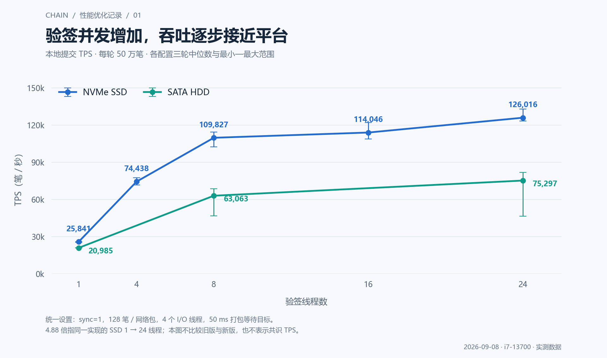
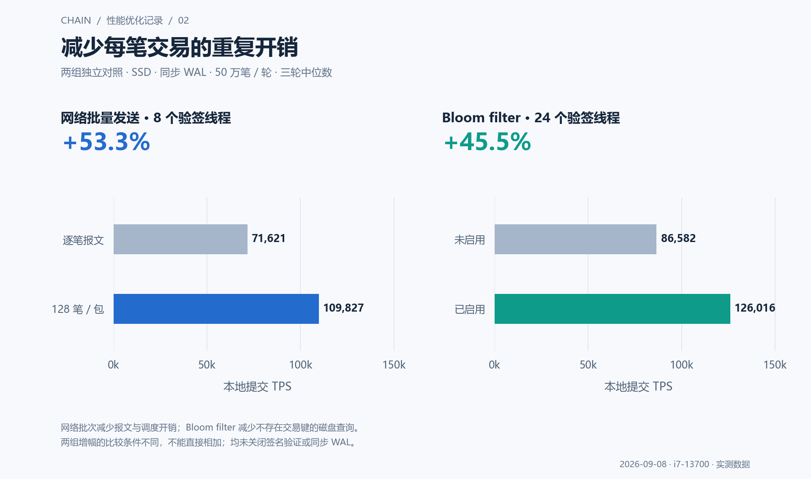
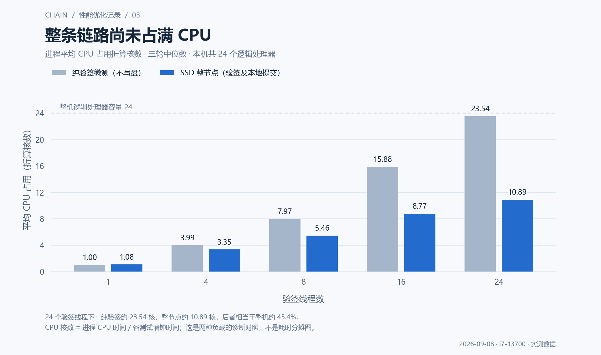
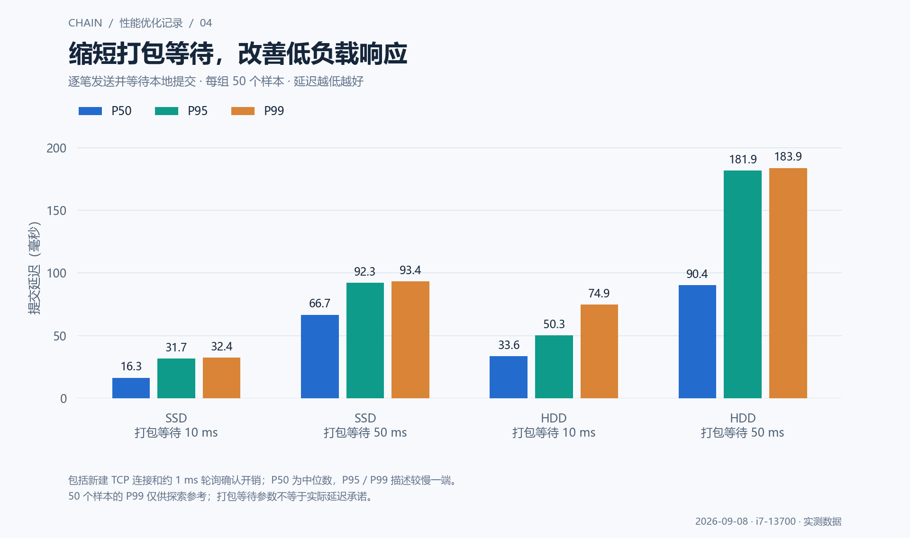

# Chain 性能优化记录

2026 年 9 月 8 日 · 代码版本 [`80c2929`](https://github.com/AdamRitz/Chain/commit/80c2929a3943dc7a3c9feee6130a283292fce376)

**本机 SSD 实测：默认 8 个验签线程约 109,827 TPS，24 线程约 126,016 TPS。** 本文回顾已完成的优化，图表直接取自保存的压测数据，本次整理未重新压测。

这里的 TPS 指交易验证通过并完成本地落库的吞吐。项目尚未实现余额与 nonce 状态执行，也没有 BFT 共识和最终性，因此这些数值不能当作完整转账账本或共识确认 TPS。

## 这次改了什么

项目沿用 C++20、Boost.Asio、libsodium 和 RocksDB，数据流仍是“TCP 接收 → 验签 → 交易池 → 打包 → 落库 → 广播”。保留原有 PascalCase 函数命名与直接调用方式。

| 修改 | 作用 |
|---|---|
| 修复交易及区块验证、批次偏移、半包处理、重放和恢复问题 | 先保证交易被正确处理，避免用漏验或漏处理换取虚假的高 TPS |
| 网络 I/O 与 CPU 验签分开，使用有界队列和背压 | 并行执行验签，避免 CPU 工作堵住网络收发 |
| 每包发送 128 笔交易，每个连接按队列顺序写入 | 摊薄报文、调度与系统调用开销，防止并发写包交错 |
| 锁外验签、短锁入池、并发查重，复用字节完全一致的验签缓存 | 减少锁内重活和重复验证，仍保留必要的一致性保护 |
| 单块一次原子 WriteBatch，启用 Bloom filter，按事件或计时触发打包 | 减少存储访问与同步写次数；默认保留 WAL 和 sync=1 |

## 1 并发提升了多少

SSD 从 1 个验签线程的 **25,841 TPS** 提升到 24 线程的 **126,016 TPS**，约 **4.88 倍**。这是同一修复后实现的线程配置对照，**不是旧版到新版的倍数**。

8 线程已达到 24 线程吞吐的约 87%，因此默认保留 8 线程。HDD 在 8 线程下为 63,063 TPS，三轮波动也更明显；数据库所在的盘比代码所在的盘更影响存储性能。

## 2 为什么能提高这么多

- **批量发送：** SSD、8 线程，从逐笔报文的 71,621 提升到每包 128 笔的 109,827 TPS，约 **+53.3%**。
- **Bloom filter：** SSD、24 线程，从 86,582 提升到 126,016 TPS，约 **+45.5%**，主要减少不存在交易键的磁盘查询。

这些改善来自减少重复工作、等待和每笔固定开销，同时增加验签并发。两组增幅来自不同对照条件，不能相加，也不能把总收益精确分摊给每项修改。

## 3 现在卡在哪里

**纯验签主要消耗 CPU；整节点的瓶颈还包括提交串行段、查重和持久化。** 24 线程时，整节点平均只使用约 10.89 个逻辑核，约占本机的 45.4%，不能说 CPU 已经跑满。

SSD 24 线程的三轮中位数中，总处理窗口约 3.97 秒，区块提交阶段约 2.39 秒，其中数据库 Write 约 1.05 秒。这些计时存在包含和并发关系，不能相加。HDD 同步写入的影响更明显；现有统计不足以断言磁盘已达到设备极限。

另测同机两个节点均落库，三轮中位数为 **24,732 TPS**。每轮 10 万笔，两节点各 8 个验签线程且同步写盘，最终链头一致。跟随者约使用 1.01 个核，未知区块逐笔验签是当前复制路径的重要限制；此结果与单节点 50 万笔测试的计时范围不同。

## 4 实时性如何改善

低负载下，SSD 将打包等待目标从 50 ms 改为 10 ms，P50 从 **66.7 ms 降到 16.3 ms**。交互场景可试用 10 ms；大量交易的吞吐实验仍使用 50 ms，并在满块时提前提交。低负载延迟测试不能证明 10 ms 在高负载下仍有相同吞吐。

## 测试口径与下一步

- **环境：** i7-13700，16 个物理核 / 24 个逻辑处理器，约 64 GiB 内存；C 盘 NVMe SSD、D 盘 SATA HDD；Windows 11，Release 构建。
- **吞吐：** 每配置 3 轮、每轮 50 万笔唯一且预签名的交易、独立新数据库；8 个发送连接、4 个 I/O 线程、每块最多 6000 笔。除明确标出的网络批次对照外均为每包 128 笔；图中节点对照均为 sync=1。签名生成不计入 TPS。
- **验证：** 最终版本 36 轮节点测试累计提交 1800 万笔，检查提交数、无效/拒绝计数和队列清空；此前核心测试 2237 个断言、网络测试 9 项场景、CTest 2/2 通过。本次仅制作报告并核对数据与图片。
- **延迟：** 每组 50 笔逐笔确认，包含新建 TCP 连接与约 1 ms 轮询开销；P99 样本少，只作探索参考。

下一步先补账户余额、nonce 和原子状态执行。现有字段更适合账户模型，生产代码预计新增或修改 600–1000 行，测试 400–700 行；这只是工程估算，不能据此预测补齐后的 TPS。复制提速优先做有去重和背压的出块前交易批量传播，再评估块内并行验签。最后补跨物理机器、长时间运行和真实状态冲突下的压测。

数据来源：[原始压测 JSON](https://github.com/AdamRitz/Chain/blob/80c2929a3943dc7a3c9feee6130a283292fce376/PERFORMANCE_RESULTS_2026-09-08.json) · [完整优化报告](https://github.com/AdamRitz/Chain/blob/80c2929a3943dc7a3c9feee6130a283292fce376/OPTIMIZATION_REPORT_2026-09-08.md) · [测试记录](https://github.com/AdamRitz/Chain/blob/80c2929a3943dc7a3c9feee6130a283292fce376/TEST_RESULTS_2026-09-08.txt)。图片使用相对路径，可随本报告一起复制或在 GitHub 中直接阅读。
