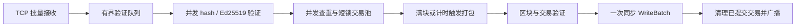

# Chain 修复、并发优化与性能报告

日期：2026-09-08。项目：`D:\Project\Chain`。修复前版本已上传：[867ee16 — 2026-09-08 保存修复前原型与审查报告](https://github.com/AdamRitz/Chain/commit/867ee16d04c52f0486d7255663f367876ff2c5ec)。

**实测结论：在本机 C 盘 NVMe SSD，默认 8 个验签线程约 109,827 TPS；24 线程中位数 126,016 TPS、最高 132,967 TPS。D 盘机械硬盘、8 线程为 63,063 TPS。** 都是 50 万笔/轮、三轮独立数据库、完整签名验证、WAL 开启且同步提交的结果。

此处 TPS 是本地验证落库吞吐，不含余额执行、跨机共识或最终性；当前项目没有这些完整能力。建议下一步实现账户模型，预计生产代码 600–1000 行、测试 400–700 行。

## 测试环境与口径

- Windows 11 Pro 10.0.26100；Intel i7-13700，16 核/24 逻辑处理器，约 64 GiB 内存。C 盘为 HP SSD EX900 1TB（NVMe），D 盘为 TOSHIBA DT02ACA200（SATA 机械硬盘）。
- GCC 15.2.0、CMake 4.0.2、Ninja，Release `-O3 -DNDEBUG`；Boost 1.91.0、libsodium 1.0.20、RocksDB 10.4.2。未修改系统电源模式或绑核，测试在正常桌面环境运行，结果存在温度/调度/后台任务波动。
- 50 万笔预生成且唯一的有效签名交易，1024 个发送钱包，176 字节/笔，8 个发送连接、4 个 I/O 线程；50 ms 打包等待目标、每块最多 6000 笔。预生成/签名耗时不计入节点 TPS。
- 正式最终版本共 36 轮节点测试，累计 1800 万笔提交；每轮均检查 `committed=500000`，无效/拒绝计数为 0，最后池与验证队列均清空。较早的未启用 Bloom 对照另外保留 21 轮。
- 本地提交 TPS：首批网络接收开始至最后一次提交完成。客户端至全部确认 TPS：还包含启动 sender、读取预生成数据及轮询确认的开销，见表格单列。不能把 sender 的发包速率当链 TPS。
- CPU 核数 = 节点进程 CPU 时间 / 测试墙钟时间；24 核数才代表本机逻辑处理器全部占满。worker 计时重叠，不能直接相加为总耗时。统计未测设备忙碌百分比或硬件缓存计数器。
- 所有压测使用新目录，保留原有链数据库。完整原始数值、硬件和代码 SHA256 见 `PERFORMANCE_RESULTS_2026-09-08.json`。

## 实际 TPS

### C 盘 NVMe SSD

| 验签线程 | 同步 WAL | 每包笔数 | 本地提交 TPS 中位数 | 三轮范围 | 客户端至全部确认 TPS | CPU 核数 / 整机占比 |
|---:|---:|---:|---:|---:|---:|---:|
| 1 | 1 | 128 | **25,841** | 25,562–25,966 | 25,732 | 1.08 / 4.5% |
| 4 | 1 | 128 | **74,438** | 71,792–77,553 | 73,613 | 3.35 / 13.9% |
| 8 | 1 | 128 | **109,827** | 102,505–114,487 | 108,109 | 5.46 / 22.8% |
| 16 | 1 | 128 | **114,046** | 108,913–122,175 | 112,613 | 8.77 / 36.6% |
| 24 | 1 | 128 | **126,016** | 123,466–132,967 | 123,391 | 10.89 / 45.4% |
| 8 | 0 | 128 | **107,169** | 103,161–110,165 | 105,419 | 5.81 / 24.2% |
| 8 | 1 | 1 | **71,621** | 70,949–71,986 | 71,000 | 6.78 / 28.3% |

当前实现中，24 线程相比单验签线程约 4.88 倍。这里比较的是同一正确性要求的新实现配置；没有把旧版漏验/漏处理交易的速率当作有效基线。128 笔网络批次明显优于逐笔报文。默认仍为 8 线程，以较少 CPU 获得大部分吞吐；24 线程适合本机吞吐实验，不是所有机器的固定最佳值。

### D 盘机械硬盘

| 验签线程 | 同步 WAL | 每包笔数 | 本地提交 TPS 中位数 | 三轮范围 | 客户端至全部确认 TPS | CPU 核数 / 整机占比 |
|---:|---:|---:|---:|---:|---:|---:|
| 1 | 1 | 128 | **20,985** | 20,954–21,183 | 20,934 | 0.92 / 3.8% |
| 8 | 1 | 128 | **63,063** | 46,822–68,565 | 62,124 | 3.78 / 15.8% |
| 24 | 1 | 128 | **75,297** | 46,615–81,966 | 74,427 | 6.25 / 26.1% |
| 8 | 0 | 128 | **90,482** | 85,705–98,506 | 89,393 | 5.76 / 24.0% |
| 8 | 1 | 1 | **53,346** | 39,127–53,848 | 52,783 | 4.81 / 20.0% |

代码放在哪个盘不是关键，`--data` 指定的数据库位置才决定存储路径。需要提高速度时可把测试/正式数据库放在已有 C 盘 SSD；本轮没有迁移或重写旧数据库。

### 两节点都完成落库

另测同机 C 盘上的一个生产者和一个跟随者，二者各 8 个验签线程、`sync=1`，每轮 10 万笔，共三轮。计时从客户端开始发送到**两个节点都提交全部交易且链头相同**，中位数 **24,732 TPS**，范围 24,335–24,797 TPS。

跟随者约占用 1.01 个 CPU 核，耗时主要在未知区块交易的逐笔验签和同步追赶。当前块验证仍是一项串行任务，生产者则可复用已并发验证的交易池，因此两种吞吐差异很大。**不能把前面的 12.6 万单节点 TPS 当作复制或集群 TPS。** 这组共享一台机器的实验也不是跨物理机器或 BFT 测试。

下一轮提高复制速度应先实现去重、跳过来源节点且有背压的出块前交易批量传播，让跟随者复用并发验签缓存；再按测量结果实现块内并行验证与有界完成聚合，避免在线程池内阻塞等待自己的子任务。先保留正确的父块顺序和全量验签。

### 低负载提交延迟

每组 50 笔，逐笔发送并等待本地提交，`sync=1`。包含一次新 TCP 连接和约 1 ms 轮询确认开销；Windows 定时器与调度也会影响值。50 个样本的 P99 只作探索性参考。

| 存储 | block-ms 目标 | P50 ms | P95 ms | P99 ms |
|---|---:|---:|---:|---:|
| C 盘 SSD | 10 | 16.3 | 31.7 | 32.4 |
| C 盘 SSD | 50 | 66.7 | 92.3 | 93.4 |
| D 盘 HDD | 10 | 33.6 | 50.3 | 74.9 |
| D 盘 HDD | 50 | 90.4 | 181.9 | 183.9 |

`block-ms` 不是延迟 SLA；它控制攒小批量的等待目标。实时交互可试 10 ms，吞吐实验保留 50 ms/满块提前提交。没有必要为降低此处延迟恢复忙等循环或关掉验签。

## 瓶颈判断

**纯验签是 CPU 工作；整条节点链路在多线程下受提交串行段、查重访问和持久化共同限制，不能简单说“CPU 已经跑满”。**

| 纯验签线程 | 中位数 tx/s | 三轮范围 | 平均使用 CPU 核数中位数 |
|---:|---:|---:|---:|
| 1 | 29,953 | 29,856–29,981 | 1.00 |
| 4 | 99,667 | 95,348–102,722 | 3.99 |
| 8 | 175,028 | 137,176–175,160 | 7.97 |
| 16 | 185,531 | 184,128–231,997 | 15.88 |
| 24 | 230,441 | 230,090–301,024 | 23.54 |

纯验签不写盘；其逻辑与最终代码一致。SSD 24 线程整节点只使用约 10.89/24 个核，但已不能线性扩展。以三轮中位数计，约 3968 ms 总处理窗口中，串行区块提交阶段约 2393 ms，其中 RocksDB Write 约 1054 ms；这些阶段有包含关系，不应重复相加。

验证线程等待提交锁的累计时间明显高于短交易池锁等待。提交锁保护“查重/入池”和确认的一致性，不能直接删除，否则会重新接收刚落库的交易。继续优化应先缩短提交段和减少重复查库，再考虑更复杂的分片容器。

本次根据测量启用 RocksDB Bloom filter 后，SSD 24 线程中位数从 86,582 提高到 126,016 TPS（约 46%）。Bloom 对不存在的键能跳过 SST 查询；命中仍由 RocksDB 正常查询确认，未用概率结构直接判交易有效。[RocksDB 官方说明](https://github.com/facebook/rocksdb/wiki/RocksDB-Bloom-Filter)

SSD 关闭同步 WAL 的节点对照没有稳定收益，波动与其它瓶颈足以抵消这部分成本，因此默认保持同步写入。HDD 的判断应结合上表、CPU 使用和下面的同步写实验；`sync=0` 仍有 WAL，但不提供同样的掉电持久性，不能当同条件性能提升。

| 存储 | sync | 逐笔 Write tx/s | 每 1000 笔 WriteBatch tx/s |
|---|---:|---:|---:|
| C 盘 SSD | 0 | 251,555 | 758,296 |
| C 盘 SSD | 1 | 985 | 518,403 |
| D 盘 HDD | 0 | 278,480 | 741,756 |
| D 盘 HDD | 1 | 111 | 86,211 |

这是只写交易索引的存储微测，不验签、不写完整块，不是区块链 TPS。非同步各 5 万笔；同步各 2000 笔/三轮，批量同步每轮只有两次 Write，数值仅说明摊薄同步开销，不能用作持续吞吐承诺。CPU 时间分辨率不足时会出现 0.0，不能解读为完全不用 CPU。更长时间、大于内存的数据量、compaction 和跨机网络仍需继续测。

## 测试与代码规模

- Release 五个可执行目标构建通过；CTest **2/2 通过**，核心测试 **2237 个断言**，网络套件 **9 项场景**。
- 核心包含异常长度、篡改、重放、并发、只读写失败/重试、恢复、版本边界；网络包含慢握手、分片、畸形包、批量提交、历史同步、活跃广播、进程重启和活 peer 正常退出。
- Git 隔离测试通过：无日期标题被拒绝；同步脚本补日期；普通提交钩子推送；本地与远端 Hash 一致。测试使用本地 bare remote，不操作真实项目历史。
 - 按节点/交易/存储/密码学工具/sender 这 13 个核心文件统计，物理行数由 1613 行变为 1539 行（包括空行和注释）；新增四个测试/压测文件共 676 行。没有把测试和文档混算成核心实现膨胀。
- 本轮未执行 ThreadSanitizer、完整模糊测试、物理断电实验、跨物理机器或真正共识压测；不能据此宣称无所有并发缺陷或生产级安全。

## 核心思想、框架与这次修改

项目的核心是“固定二进制交易 → 验证交易池 → Merkle 区块 → 持久化 → TCP 传播”。每笔交易为 176 字节，含发送方/接收方、amount、nonce、32 字节 hash 和 64 字节签名；区块为 112 字节头部加交易数组。当前属于签名交易和区块传播原型，尚未执行余额与 nonce 状态，也没有完整共识。

| 层 | 技术与职责 | 本次处理 |
|---|---|---|
| 网络 | Boost.Asio C++20 协程、TCP、小端帧 | I/O 与验签线程池分离，每连接 strand 与串行写队列 |
| 交易 | libsodium Ed25519、BLAKE2b-256、unordered_map | 重算 payload hash，锁外批量验签，并发查重、短锁入池 |
| 区块 | Merkle 树、三格候选窗口 | 快照后打包，整块校验，成功提交后再清理交易池 |
| 存储 | RocksDB 10.4.2 | 单块一次 WriteBatch，默认同步 WAL，Bloom filter，检查 Status |
| 启动/配置 | CMake/Ninja、YAML、CLI、spdlog | 参数可配置、链头恢复、退出清理、性能指标 |
| 实验密码学 | 自定义 VRF | 增加长度、点和标量校验；仍未接入选主，未替代为标准 VRF |

继续使用 `GenerateTx`、`VerifyTransaction`、`ProcessTxPackage`、`GenerateBlock`、`ProcessBlock`、`MainLoop` 等命名与现有目录，按原来的 PascalCase 和直接函数调用风格实现，没有引入 Actor、消息总线、通用执行器框架或多层接口。主要复杂度来自正确处理异步连接生命周期和持久化一致性。

## 已修复的问题

| 原问题 | 修改位置/行为 | 验证证据 |
|---|---|---|
| 签名只校验传入 hash，篡改金额/收款人仍能通过 | `VerifyTransaction` 重新计算前 80 字节的 hash，再验签 | 六个字段篡改、错误私钥/公钥组合、有效交易 |
| 区块路径绕过验签，缓存可误信同 hash 的不同字节 | `VerifyBlock` 校验长度、header、Merkle、重复 hash 和签名；只复用字节完全相同的已验证池记录 | 无效签名块、缓存篡改、同块重复、同步 type 7 注入 |
| 批处理反复读第一笔、尾部越界 | 按 176 字节递增偏移，拒绝非整数笔和超大包 | 两笔不同交易、截断包、4096 笔网络提交 |
| 消息长度不统一、半包处理错误和分配过大 | 统一 5 字节帧头；按 type 先验证长度，再分配/读取正文 | 分片发送、非法类型、UINT32_MAX、截断/错误长度 |
| 广播协程没有运行，多协程交错写同一 socket | 广播改为明确投递；每 peer 一条有限写队列，共享大缓冲区 | 历史同步、活连接广播、跟随者链头一致 |
| 慢握手阻塞 accept，锁跨 await，I/O 上直接验签 | 独立握手与超时、peer strand、CPU 线程池、有界排队与背压 | 慢连接不影响新请求，队列上限测试，并发压测 |
| 提议即删除交易，失败仍推进高度，存储非原子 | 提议只快照；整块原子写；成功后移除池记录、推进 epoch | 只读 DB 写失败、重试、错误父块、重复提交、重启 |
| 启动重置链头、错误高度索引/整数读取 | 恢复并验证已有 head；二次索引读取完整块；检查 uint64/长度和 schema | 重启防重放、64 位高度、坏元数据和未知版本拒绝 |
| 并发入池与提交可能重复接收已确认交易 | DB 共享读锁与提交独占锁配合；池锁仅保护容器 | 多线程重复提交与出块同时运行，2048 笔恰好落库 |
| 时间和事件处理不可靠 | monotonic 计时、实时 epoch 毫秒、条件变量唤醒同步、有限时间退出 | 时间更新、窗口推进、活 peer 正常退出 |
| 随机 DLL 冲突导致 CTest 子进程卡住 | 为 Windows CTest 显式优先设置编译器运行库路径 | 诊断发现 Strawberry/Poppler 同名 DLL；修复后完整 CTest 通过 |

默认保留 WAL 和 `sync=1`。原子性与同步写的含义遵循 [RocksDB 官方文档](https://github.com/facebook/rocksdb/wiki/Basic-Operations)：一组变更一起写入，同步写在持久化请求完成后返回。本轮做了进程终止/恢复和写失败测试，没有做物理断电实验。

## 为什么先选择账户模型

**建议：在当前代码上先实现账户模型。** 现有交易已经有 `sender / receiver / amount / nonce`，补充余额与 nonce 状态的改动更集中。选择依据是现有结构、维护成本和实测瓶颈，并不是“账户模型天然一定比 UTXO 快”。

| 对比 | 账户 | UTXO |
|---|---|---|
| 状态 | 地址 → balance / nonce | outpoint → 未花费输出 |
| 与现有代码适配 | 现有交易字段基本可沿用，补链 ID/domain | 改为有界的输入/输出列表，改 hash、签名和序列化 |
| 并发机会 | 读写账户集合不冲突的交易可并行 | 消耗不同输出的交易可并行 |
| 必须处理的冲突 | 同发送者 nonce、发送/接收账户相交、热点收款地址 | 同一输出双花、区块内前后依赖、找零和选币 |
| 额外存储 | 更新被触及的账户；需要原子状态与块提交 | 删除输入、创建输出、维护查询/选币索引 |
| 当前优先级 | 高：最短路径补成正确的转账账本 | 有明确的独立资产/支付输出需求时再选 |

账户余额和 nonce 的定义可参考 [Ethereum 账户文档](https://ethereum.org/developers/docs/accounts/)；UTXO 的输入引用、输出和花费规则可参考 [Bitcoin 开发文档](https://developer.bitcoin.org/devguide/transactions.html)。这里借鉴数据模型，不引入 Ethereum VM 或 Bitcoin Script。

并行性取决于实际状态冲突和执行设计，不能单由名称决定。确定交易顺序之后仍然可以并行执行并检测依赖，[Block-STM 原始论文](https://arxiv.org/abs/2203.06871) 给出了这类方法。本项目第一阶段更适合“并行验签 + 简单确定性状态执行”，测出状态执行确实成为瓶颈后，再按发送与接收账户的读写集合做分组；暂不需要照搬完整 STM 引擎。

**代码量估算（新增/修改行数，包含必要的错误处理）：**

| 模块 | 账户生产代码 | UTXO 生产代码 |
|---|---:|---:|
| 状态结构、创世分配、序列化/chain domain | 100–170 | 250–400 |
| 交易合法性、余额/nonce 或输入/输出守恒 | 180–280 | 300–450 |
| 池内冲突/顺序、打包与执行 | 120–210 | 200–350 |
| 原子落库、查询、恢复与调用接入 | 200–340 | 450–800 |
| **生产代码合计** | **600–1000** | **1200–2000** |
| **测试代码** | **400–700** | **700–1200** |
| **合计** | **1000–1700** | **1900–3200** |

这是基于现有小项目的工程估算，不是已实现的功能或交付保证；不含智能合约、通用 VM、BFT 共识、分叉回滚、钱包 UI、跨链或完整标准 UTXO 脚本。初始状态执行先保证正确与确定性，之后才有资格比较两种真实模型的 TPS；当前压测不能预测添加状态执行后的准确速度。

## 还不能视为完成的能力

- 当前签名有效的交易未经过余额、nonce 连续性、金额守恒或 chain ID 检查；确切相同 hash 的已确认交易会拒绝，但同一 nonce 的不同内容交易不等于已经实现双花保护。
- 单生产者与跟随节点联调成功；多生产者一致性、恶意节点容错、选主/投票、分叉重组和最终性尚未实现。候选块优先级不是 BFT。
- 新版 peer 握手和正确帧协议需要节点一起升级。旧键格式保留读取回退，旧数据本身若已损坏则报错，未自动重写历史链。
- 默认回环监听，实验网络尚无 peer 身份鉴别。钱包仍为启动时临时生成；自定义 VRF 没有完成标准化与密码学审计。
- 本轮不改动原有数据库，也没有用跳过签名、关闭 WAL 或减少验证内容来宣传 TPS。

优先顺序：账户状态与原子执行 → 确定信任模型和共识 → 两机/长时间延迟与吞吐测试 → 针对真实状态冲突优化。详细清单见 `NEXT_STEPS_2026-09-08.md`。

## Git 与复现

提交标题按 `YYYY-MM-DD 描述`。`commit-msg` 检查格式；`Sync-Repo.ps1` 可自动补当天日期；`post-commit` 将完成的本地提交推送到 `origin/master` 的当前同名分支。文件保存本身不会生成提交。认证或网络失败会保留本地提交并报错，禁止强推。

构建、独立节点、跟随节点和完整压测命令见 `README.md`，Git 使用见 `GIT_SYNC.md`。原始 benchmark 结果来自仓库中的 `Test/RunBench.py`，源码和结果会与本报告一起提交。
