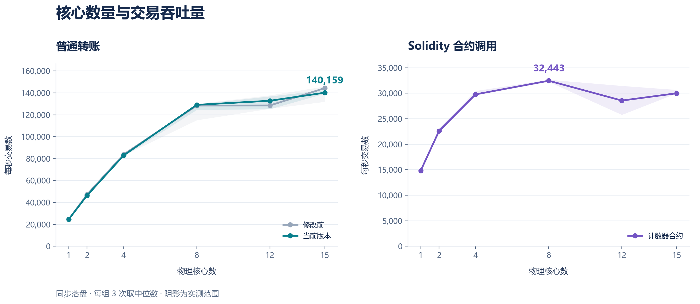

# 分叉恢复、EVM 合约与多核性能测试

日期：2026-09-16。对比版本：`3c76e13`。本次实现代码及复现脚本与报告一起提交。

本轮最高中位数：普通转账 **140,159 笔/秒，15 核**；Solidity 计数器合约 **32,443 次/秒，8 核**。相同 15 核条件下，普通转账比修改前下降 **2.89%**。



## 完成的修改

**分叉恢复。** 节点交换链头，按哈希补齐分支，找到共同祖先后回滚并重放。分支按累计有效交易数、高度和链头哈希排序。同父块继续优先选择交易更多的候选。恢复窗口为 256 个区块。

**原子状态切换。** 账户余额、序号、合约代码与存储、执行回执、费用、交易索引和链头在同一写批次中切换。执行失败及写盘失败时恢复原状态；退出主链且仍有效的交易重新入池。未来候选按哈希保留，较大的无效候选与有效候选分别处理。

**合约执行。** 接入以太坊虚拟机（Ethereum Virtual Machine，EVM）执行引擎 evmone，固定 Shanghai 规则。通过 `evm_sender` 部署与调用 Solidity 合约，保存返回值、事件、Gas 消耗和执行状态。Gas 是执行资源的计量单位，价格固定为每单位 1 个链上最小金额单位。合约交易签名绑定完整输入及创世摘要。

**回滚记录优化。** 连续账户序号保证新交易索引尚未写入，回滚记录直接保存删除操作；旧账户值从内存取得。这项修改减少了生成回滚记录时的数据库查询。

## 性能结果

每秒交易数的完整名称为 Transactions Per Second，缩写为 TPS。下表为每组三次运行的中位数，计时覆盖发送端启动、网络发送、验证、执行及本机同步落盘。

| 物理核心数 | 修改前普通转账 | 当前普通转账 | 当前合约调用 |
|---:|---:|---:|---:|
| 1 | 24,700 | 24,653 | 14,836 |
| 2 | 47,250 | 46,396 | 22,586 |
| 4 | 83,805 | 82,928 | 29,775 |
| 8 | 128,398 | 129,087 | **32,443** |
| 12 | 128,523 | 132,801 | 28,558 |
| 15 | **144,326** | **140,159** | 29,985 |

普通转账在 15 核下的三次结果为 139,308、140,159、142,535 笔/秒。合约调用在 8 核下为 32,443、32,648、32,238 次/秒。图中的阴影表示三次实测范围。

测试环境与工作负载：

| 项目 | 设置 |
|---|---|
| 处理器 | Intel Core i7-13700，16 个物理核心、24 个逻辑处理器 |
| 核心分配 | 预留 1 个性能核心给发送端；节点每个物理核心使用 1 个逻辑处理器 |
| 横轴含义 | 通过进程亲和性实际绑定的物理核心数量 |
| 核心类型 | 1/2/4 核使用性能核心；8/12/15 核分别为 7 个性能核心加 1/5/8 个能效核心 |
| 验签线程 | 与所选核心数量相同 |
| 网络线程 | 所选核心数与 4 中的较小值 |
| 数据库 | RocksDB，新建隔离目录，`--sync 1` |
| 测试磁盘路径 | 本机 C 盘的独立测试目录 |
| 普通转账 | 每轮 300,000 笔预签名交易，1,024 个账户，最大块 6,000 笔，等待 50 毫秒 |
| 合约调用 | 每轮 100,000 次预签名调用，64 个账户调用同一个计数器；每次更新存储、记录事件并返回值 |
| 合约块参数 | 最大 256 笔，等待 10 毫秒，单笔 Gas 上限 100,000 |
| 重复方式 | 6 个核心配置、3 类工作负载、3 次交替运行，共 54 轮 |
| 数据准备 | 签名及合约部署在计时开始前完成，结果核对在计时结束后进行 |

普通转账的新旧版本使用相同交易字节、创世配置和发送端。所有轮次核对提交数；普通转账逐账户核对余额与序号，合约核对最终计数值、代码、账户序号及资金总量。18 个合约性能数据库另行完成重启检查。

## 资源使用与下一步优化

中央处理器（Central Processing Unit，CPU）的使用率按节点进程 CPU 时间除以运行时间和分配核心数计算。

| 场景 | 分配核心使用率中位数 | 平均忙碌核心数中位数 | 同步写盘累计耗时中位数 |
|---|---:|---:|---:|
| 普通转账，1 核 | 97.1% | 0.97 | 1.21 秒 / 300,000 笔 |
| 普通转账，15 核 | 57.9% | 8.68 | 0.81 秒 / 300,000 笔 |
| 合约调用，8 核 | 29.8% | 2.38 | 1.00 秒 / 100,000 次 |

单核转账接近满负载，增加核心提升了验签吞吐。多核下，构块、状态执行与同步提交仍经过顺序处理路径。8 核合约测试的账户和合约校验累计约 1.43 秒，写盘约 1.00 秒；同一候选在接收检查及正式提交时均执行状态校验。

下一步优先减少相同父状态下的重复合约执行，并减少 EVM 状态副本与逐账户序列化。继续用当前计数器负载及不同合约之间的独立调用分别测试。各阶段和各线程计时存在重叠，累计时间用于定位处理路径。

## 正确性验证

完整构建成功。七项测试全部通过，总耗时 32.23 秒：

| 测试 | 验证内容 |
|---|---|
| ChainCorrectness | 原生交易、区块、消息、数据库及并发 |
| AccountCorrectness | 余额、序号、费用、乱序交易与失败原子性 |
| ForkStateCorrectness | 无效分支、写盘失败、原生及 EVM 缓存恢复、交易索引与回执切换 |
| ChainNetwork | 交易网络入口、分片、复制及恢复 |
| AccountNetwork | 钱包、转账、查询及收费复制 |
| ForkNetwork | 同高度不同交易数、多块分支补齐、重启和未来无效候选 |
| EvmNetwork | 真实 Solidity 部署、存储、返回值、事件、嵌套调用、回退、Gas 耗尽、预编译、复制及合约分叉恢复 |

同高度、相同交易数的两条分支按哈希选择后，两个节点的链头、原生余额、费用、合约存储及有效回执一致。被替换分支的回执和交易索引随原子切换移除。

## 使用与复现

- [合约部署与调用说明](../../EVM_GUIDE.md)
- [模块与修改指南](../../MODULE_GUIDE.md)
- [固定依赖版本及适配说明](../../ThirdParty/VERSIONS.md)
- [原始运行数据](results.json)、[汇总](summary.json)、[逐轮表格](runs.csv)、[环境及可执行文件摘要](config.json)
- [合约性能数据库重启检查](evm-recovery-checks.json)
- [矢量图](cores-tps.svg)

```powershell
python Test/BenchCores.py --bin <当前构建目录> --baseline <3c76e13构建目录> `
  --work <新的测试目录> --native-count 300000 --evm-count 100000 --repeats 3
python Test/PlotCores.py --results <测试目录>/results.json --out <图表目录>
```

当前数据库版本为 4，默认目录 `data/accounts-v4`。版本 2、3 的原数据库保留，运行本版本时提供新目录和创世配置。合约通过本项目钱包和二进制协议接入；BN254 配对预编译、Ethereum JSON-RPC（JavaScript Object Notation Remote Procedure Call）及以太坊签名交易格式列为后续兼容任务。
