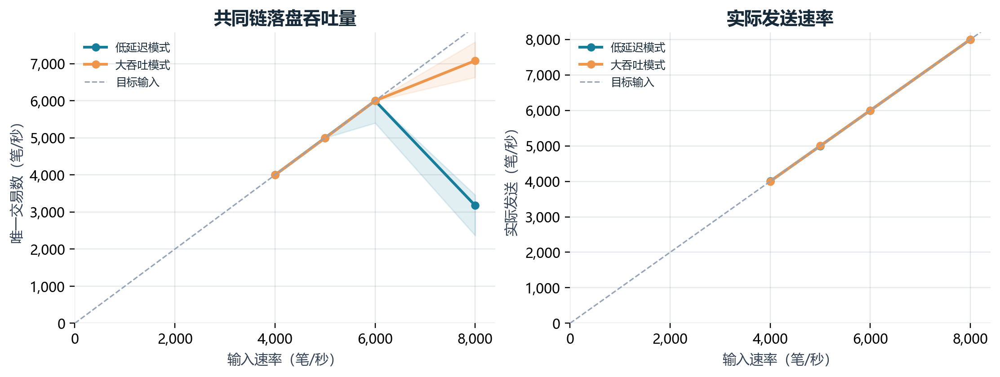
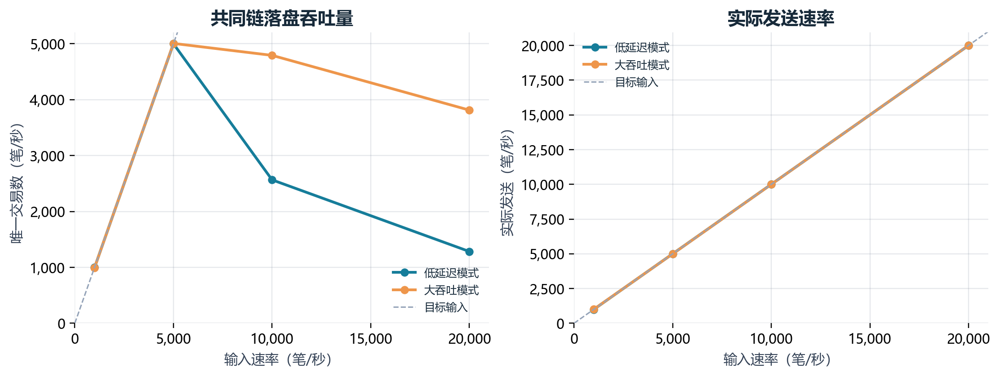
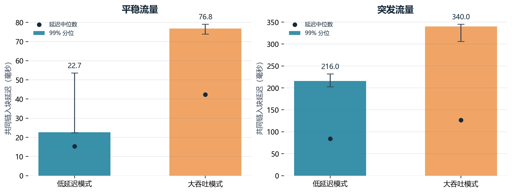
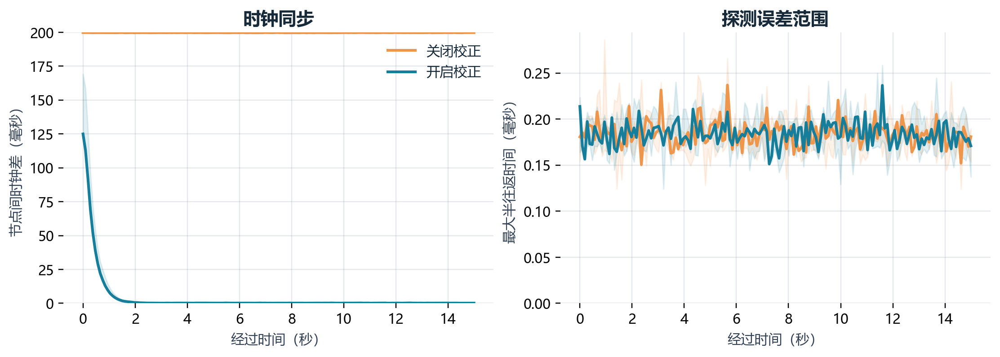
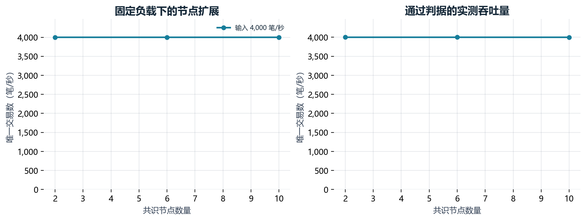
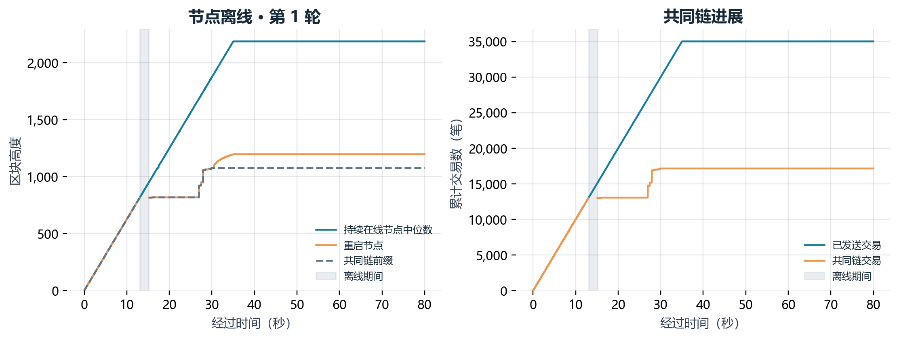
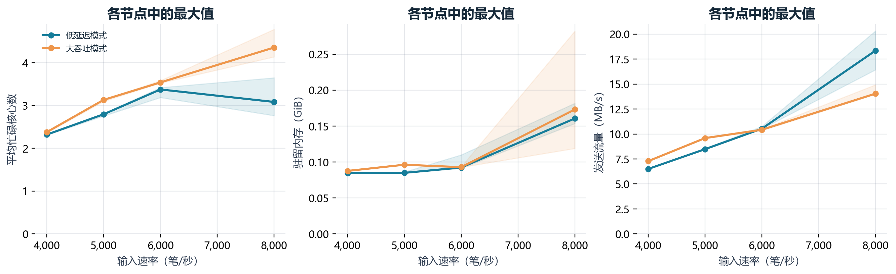

# 十节点云服务器实验记录

日期：2026-09-30。测试代码：`8cf3a5fec4278fd244beb80eef0a98c753eb3d1f`。

## 主要结果

吞吐量扫描中，低延迟模式三次均通过的最高档位为每秒 5,000 笔；大吞吐模式三次均通过的最高档位为每秒 5,000 笔。

节点离线 2 秒后的三轮恢复实验均未在本轮等待窗口内恢复共同链，恢复同步与分支收敛是下一步优先修复项。

## 环境与口径

- 十台 Ubuntu 24.04.4 服务器，每台 8 个逻辑核心、16 GiB 内存，系统识别约 15.12 GiB；处理器为 AMD EPYC 9K85。节点使用腾讯云内网通信。
- Release 构建，GCC 13.3，RocksDB 8.9.1。每节点 4 个网络线程、8 个验签线程。数据库开启同步落盘；交易为原生账户转账，每笔 176 字节，1,024 个测试账户。
- 每个用例使用独立数据库和同一份签名交易数据。每个条件重复 3 次，预热 5 秒、测量 30 秒，结束后最多等待 45 秒清空积压；时钟实验每轮 15 秒。
- 每秒交易数（Transactions Per Second，TPS）按全部在线实验节点一致的已落盘共同链前缀计算。延迟从计划产生交易开始，包含发送排队、网络、执行、落盘与采样等待；轮询间隔 10 毫秒。
- 02 号服务器同时运行一个区块链节点、发送端与采集程序。记录发送端实际速率及中央处理器（Central Processing Unit，CPU）占用，作为解释实验结果的依据。
- 持续负载判据：实际发送和共同链落盘速度均达到目标的 95%，账户核对通过，交易拒绝与非法计数为零，抽样全部完成，十节点排队副本总量的增长斜率不超过每秒 10 笔。

## 构建与验收

Ubuntu 首次构建发现 RocksDB 打开接口的版本差异，已改用兼容接口，并继续由智能指针管理数据库对象。八项 CTest 全部通过；随后完成 12 个短时验收用例、8 个负载扫描用例和 54 个重复实验用例。

重复实验流程完成 54/54 个；包含交易的用例中，最终全节点链与账户核对通过 42/48 个。

## 吞吐量

下表取三次重复的中位数。状态核对要求全部节点链头、账户余额、账户序号及唯一交易数一致。

| 模式 | 输入（笔/秒） | 共同链吞吐量（笔/秒） | 99% 分位延迟（毫秒） | 持续负载通过 | 状态核对通过 |
|---|---:|---:|---:|---:|---:|
| 低延迟 | 4,000 | 3,997.9 | 61.5 | 2/3 | 3/3 |
| 低延迟 | 5,000 | 4,999.5 | 114.0 | 3/3 | 3/3 |
| 低延迟 | 6,000 | 5,999.3 | 220.0 | 2/3 | 3/3 |
| 低延迟 | 8,000 | 3,175.0 | 7,672.4 | 0/3 | 0/3 |
| 大吞吐 | 4,000 | 3,999.8 | 115.9 | 2/3 | 3/3 |
| 大吞吐 | 5,000 | 4,993.9 | 188.1 | 3/3 | 3/3 |
| 大吞吐 | 6,000 | 6,000.1 | 147.5 | 1/3 | 3/3 |
| 大吞吐 | 8,000 | 7,080.6 | 6,105.1 | 0/3 | 3/3 |

三次均通过持续负载判据的最高扫描档位：低延迟模式 5,000 笔/秒；大吞吐模式 5,000 笔/秒。



前置扫描还测试了每秒 10,000 与 20,000 笔。其原始结果与下面的扫描图保留，用于观察高负载下的吞吐下降、延迟与积压。



## 实时性

平均输入固定为每秒 2,000 笔。平稳流量均匀到达；突发流量集中在每秒前四分之一时间到达。低延迟模式等待 10 毫秒、每块最多 512 笔，大吞吐模式等待 50 毫秒、每块最多 6,000 笔。

| 模式 | 流量 | 延迟中位数（毫秒） | 99% 分位延迟（毫秒） | 100 毫秒内完成比例 |
|---|---|---:|---:|---:|
| 低延迟 | 平稳 | 15.3 | 22.7 | 100.0% |
| 低延迟 | 突发 | 84.3 | 216.0 | 61.5% |
| 大吞吐 | 平稳 | 42.3 | 76.8 | 99.8% |
| 大吞吐 | 突发 | 126.6 | 340.0 | 35.7% |



## 时钟同步

当前代码采用四时间戳测偏差和邻居中位数校正。实验注入 −100～100 毫秒初始偏差，以及 −50、0、50 百万分率（Parts Per Million，PPM）的频率漂移。

| 设置 | 最终节点间时钟差中位数（毫秒） | 收敛时间中位数（秒） |
|---|---:|---:|
| 关闭校正 | 199.639 | 未观测到 |
| 开启校正 | 0.192 | 1.505 |

收敛采用连续五次观测低于 2 毫秒的首次时刻。图中同时给出探测的半往返时间。



## 节点规模

以每秒 4,000 笔固定输入比较 2、6、10 个共识节点。每个规模重复三次。

| 节点数 | 共同链吞吐量中位数（笔/秒） | 持续负载通过 | 状态核对通过 |
|---:|---:|---:|---:|
| 2 | 4,000.0 | 3/3 | 3/3 |
| 6 | 3,999.9 | 3/3 | 3/3 |
| 10 | 3,999.9 | 2/3 | 3/3 |



## 离线恢复

固定每秒 1,000 笔，测量第 8 秒停止末尾节点，2 秒后重启，重复三次。恢复要求连续三次观测到十个节点链头一致。

| 重复 | 恢复时间（秒） | 最终状态核对 |
|---:|---:|---|
| 1 | 未观测到 | 共同链未收敛 |
| 2 | 未观测到 | 共同链未收敛 |
| 3 | 未观测到 | 共同链未收敛 |

第一轮恢复样本中，各节点均记录 35,000 笔链上交易，九个节点高度为 2,186，重启节点高度为 1,197，共同前缀停留在高度 1,074。两类节点最终相差 989 个块，超过当前 256 块的分支恢复窗口。下一步需要检查落后节点同步、恢复期间出块控制与长分支追赶路径。原始用例为 `0016-fault-r1`。



## 资源与优化入口



前置扫描中，最忙节点平均使用约 2～3.3 个逻辑核心，峰值驻留内存低于 350 MiB。8,000 笔输入的一段控制机采样中，最忙线程接近占满一个核心，主机输入输出等待约 0.04%；该辅助采样覆盖约 11 秒。具体阶段开销同时见原始时间线的区块验证、队列等待、提交与数据库写入计数。

优先调整两个位置：

1. `Transaction/Block.h` 的 `ProcessBlock`：当前先执行 `VerifyBlock`，随后才比对区块是否已在规范链。可增加对已验证区块的精确复用，减少重复广播引起的验签与解析。
2. `Network/Client.h` 与 `Transaction/Fork.h`：补齐重启节点追赶过程中的出块条件和超过窗口的恢复路径，再用相同离线用例与高负载数据复测。

## 复现实验

本地 `bench-results/cloud-20260930/` 保存各用例的计划、完整指标、机器摘要、节点日志、交易延迟样本及同步和故障时间线。全部原始逐时刻统计保存在服务器 `/home/ubuntu/chain/results/`，各用例数据库保存在 `/home/ubuntu/chain/node-results/`。

测试使用现有密码会话进行内存认证。部署运行脚本保存在跳板机的 `run_cloud_cluster.py`，计划为 `baseline-cloud.json`；再次执行时使用新的输出目录。

```bash
/home/ubuntu/chain/releases/2026-09-30-d4106d1/.venv/bin/python /home/ubuntu/chain/run_cloud_cluster.py --plan /home/ubuntu/chain/baseline-cloud.json --work /home/ubuntu/chain/results/20260930-repeat-02 --suite all
```

发布目录名保留初始代码号 `d4106d1`，实际构建包含 RocksDB 兼容修复，以 `BUILD_MANIFEST.json` 中的提交号和二进制摘要为准。
