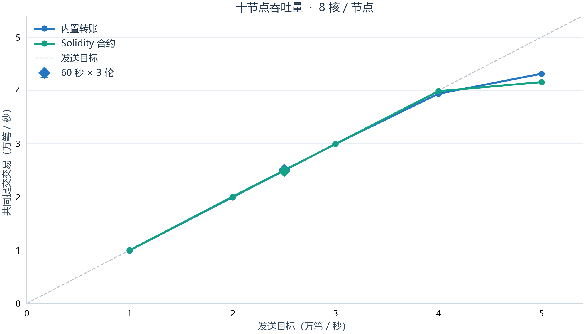
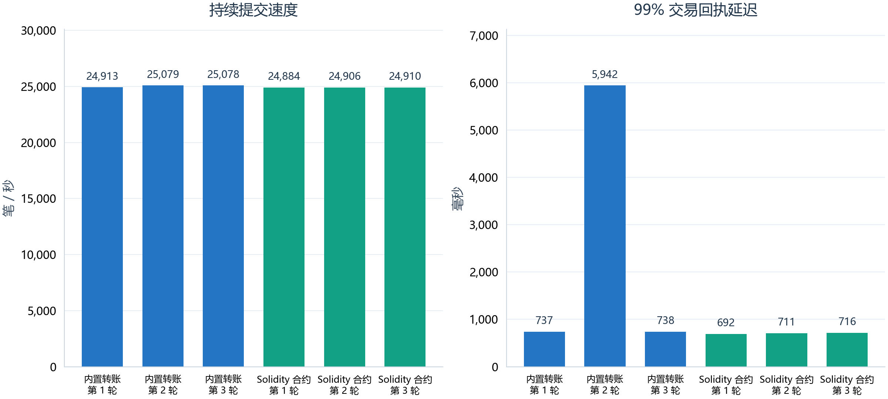
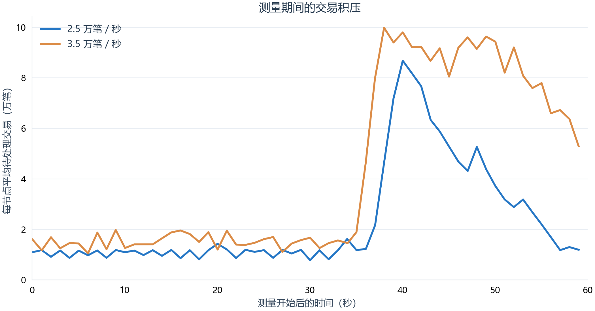
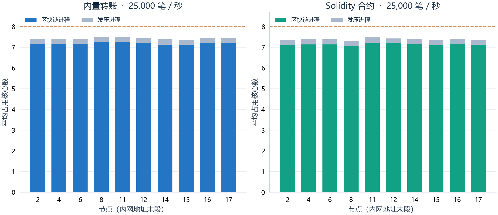

# FISCO BCOS 十节点性能测试

测试日期：2026 年 9 月 30 日。十台腾讯云服务器，每台 8 个逻辑处理器、16 GiB 内存，节点通过内网通信。正式版本为 FISCO BCOS v3.7.3。

## 测得的吞吐量

下表“持续吞吐”为每轮预热 10 秒、测量 60 秒、重复三轮的共同链吞吐中位数。三轮均完成交易、状态和余额核对，窗口末尾积压净增长满足本文验收条件。TPS 全称为 Transactions Per Second，即每秒交易数。

| 业务 | 持续吞吐 / TPS | 三轮范围 / TPS | 99% 回执延迟中位数 | 短时峰值 / TPS |
|---|---:|---:|---:|---:|
| 内置转账 | 25,078 | 24,913–25,079 | 738 毫秒 | 43,130 |
| Solidity 合约 | 24,906 | 24,884–24,910 | 711 毫秒 | 41,564 |

短时峰值来自 100 毫秒封块配置的 20 秒测量窗口；持续结果采用 200 毫秒封块配置。5 万笔/秒的发送目标导致积压和延迟增长。表中持续吞吐为本次负载档位中通过三轮验收的最高结果。

六轮的 99% 回执延迟为 692–5,942 毫秒，波动见下图。

## 测试环境与业务

| 项目 | 设置 |
|---|---|
| 硬件 | 每台 8 个逻辑处理器，AMD EPYC 9K85；系统可用内存约 15.12 GiB |
| 操作系统 | Ubuntu 24.04.4，Linux 6.8，x86-64 |
| 网络 | 腾讯云内网；购买配置为 5 Gbps、每秒 100 万包 |
| 节点 | 10 个共识节点，0 个观察节点，Air 部署，单群组 |
| 共识 | Practical Byzantine Fault Tolerance，PBFT，实用拜占庭容错 |
| 版本 | 官方稳定版 v3.7.3；源码提交 `5811f123b0a82928de8ec662e84763d67c16fb1e` |
| 客户端 | Java 17；Java Software Development Kit（SDK，软件开发工具包）3.7.0 |
| 区块 | 单块最多 10,000 笔；最终持续测试最小封块间隔 200 毫秒，前期扫描为 100 毫秒 |
| 交易池 | 200,000 笔，8 个验签线程；每节点 4 个远程调用线程 |
| 执行 | 经典执行路径，启用 Directed Acyclic Graph（DAG，有向无环图）并行执行 |
| 存储 | RocksDB，缓存开启，`key_page_size=0`，沿用官方默认写入选项 |
| 发压 | 每台一个 Java 进程，2 个可用处理器，2 个 SDK 回调线程，4 个发送线程，最大堆 2 GiB |
| 在途上限 | 每台约 10,000 笔，合计约 100,000 笔 |
| 账户 | 每台 2,048 个，总计 20,480 个；每轮账户名前缀独立 |
| 签名与传输 | ECDSA（Elliptic Curve Digital Signature Algorithm，椭圆曲线数字签名算法）；TLS（Transport Layer Security，传输层安全协议）开启 |

版本选择依据[官方版本说明](https://github.com/FISCO-BCOS/FISCO-BCOS#版本信息)。采用[官方性能测试样例](https://fisco-bcos-doc.readthedocs.io/zh-cn/latest/docs/operation_and_maintenance/stress_testing.html)中的两类业务：`ParallelOk` Solidity 余额转账，以及地址 `0x100c` 的 `DagTransfer` 内置转账。包装类及合约字节码固定为 [java-sdk-demo v3.10.0](https://github.com/FISCO-BCOS/java-sdk-demo/tree/v3.10.0)。

Solidity 测试每台部署一个合约，共 10 个。内置转账共用一个预编译合约，使用独立账户名前缀。账户按相邻两两配对交替转账，每笔金额为 1，初始余额为 1,000,000,000。这个负载用于观察低冲突余额更新的性能。正式轮次复用同一条稳定版测试链，持续累积历史数据。

签名、合约部署、账户初始化在计时前完成。节点在计时内完成接收、验签、传播、共识、执行和存储提交。发送端与节点共用上述 8 个处理器。各端通过统一开始时间文件同步发压，并记录实际开始时间差。

## 如何统计

每秒查询十个节点的已提交交易计数，取最小值形成共同链计数。在十个发送端测量区间的交集中，用首末两个完整观测的计数差除以时间差，得到共同链 TPS。实际观测窗口及原始计数保存在数据文件中。

交易成功需满足链上回执执行成功；内置转账还需返回成功码。推送回执延迟或超时时，按预先保存的交易哈希查询回执，并核对哈希与执行结果。补查交易的延迟包含等待和查询时间。回执延迟从实际发送开始；另保留从计划发送时刻起算的延迟。

持续负载验收条件：测量至少 60 秒；实际发送和共同链速度均达到目标的 95%；所有交易取得成功结果；所有账户余额正确；十节点高度、区块哈希、状态根和累计交易数一致；最终交易池清空；平均每节点积压的净增速不超过 `max(10, 目标速率 × 1%)` 笔/秒。净增速为测量窗口首末积压之差除以观测时间。对同一业务、负载和配置阶段做三轮，均通过后计入持续吞吐。

同时保留积压的线性拟合斜率。2.5 万档位出现过窗口中部排队、末尾回落的情况；拟合斜率会受到这种波峰影响。最终采用净增长判断是否持续累积，并单独报告延迟与队列波动。早期执行日志的验收标签按拟合斜率生成；本报告按 `net-backlog-v2` 统一重算，数据中保留原斜率判据的结果。

分位延迟通过各端 1 毫秒直方图合并，最多向上取整 1 毫秒。初始化交易和合约部署纳入总量核对，排除在吞吐计时之外。

下图各选取一轮内置转账实验。2.5 万档位在测量末尾回到约 1.2 万笔待处理交易；3.5 万档位在末尾仍有约 5.3 万笔。各轮停止发送后继续等待并核对全部交易。

## 处理器与带宽

正式通过的持续测试中，区块链进程平均占用 6.99–7.34 个处理器核心，发压进程占用 0.22–0.29 个核心。4 万及以上负载观测中，主机处理器忙碌比例为 86.8%–98.5%。高负载主要表现为处理器压力和交易积压；内存与网络带宽仍有余量。长时间运行中的具体耗时来源，可继续对验签、交易池、执行与存储调用做采样定位。

| 指标 | 各节点、各通过轮次的范围 |
|---|---:|
| 主机处理器空闲比例 | 4.26–8.94% |
| 磁盘输入输出等待比例 | 0.07–0.29% |
| 磁盘忙碌时间比例 | 14.51–24.10% |
| 磁盘请求平均完成时间 | 1.96–4.18 毫秒 |
| 区块链进程峰值常驻内存 | 1.73–1.95 GiB |
| 发压进程峰值常驻内存 | 0.44–0.97 GiB |
| 每台接收带宽 | 339.8–341.2 Mbps |
| 每台发送带宽 | 328.6–329.9 Mbps |
| 每台接收数据包 | 62759–64923 包/秒 |
| 每台发送数据包 | 41515–43829 包/秒 |
| 区块链进程磁盘写入 | 92.8–119.5 MB/秒 |

CPU 全称为 Central Processing Unit，即中央处理器。资源采样间隔约 1 秒，处理器占用由进程累计处理器时间差计算。Gbps/Mbps 分别为每秒十亿/百万比特，MB/秒为每秒百万字节，GiB 为二进制容量单位 Gibibyte。磁盘写入取进程写入计数，输入输出等待取主机计数。

后续提升吞吐可优先增加单节点处理器资源，并为发压程序配置独立机器；当前 16 GiB 内存和内网带宽仍有余量。增加节点数量时重新测量广播与共识开销。业务复杂度、账户冲突、区块参数和存储策略变化后，使用同一套计量流程重测。

## 每轮结果

净增速与拟合斜率的单位均为平均每节点每秒增加的待处理交易数。负数表示队列回落。

| 用例 | 测量秒数 | 实际发送 / TPS | 共同链 / TPS | 99% 延迟 / 毫秒 | 净增速 | 拟合斜率 | 持续验收 |
|---|---:|---:|---:|---:|---:|---:|---|
| `stable-native-10000-v2` | 20 | 10,000 | 9,963 | 125 | +35.8 | +0.4 | 短时 |
| `stable-native-20000` | 20 | 20,000 | 19,952 | 158 | +32.6 | -6.4 | 短时 |
| `stable-native-25000-seal200-r1` | 60 | 25,000 | 24,913 | 737 | +84.1 | +7.3 | 通过 |
| `stable-native-25000-seal200-r2` | 60 | 25,000 | 25,079 | 5,942 | +16.4 | +609.4 | 通过 |
| `stable-native-25000-seal200-r3` | 60 | 25,000 | 25,078 | 738 | -12.7 | -12.3 | 通过 |
| `stable-native-30000` | 20 | 30,000 | 29,958 | 229 | +45.9 | +22.1 | 短时 |
| `stable-native-30000-r1` | 60 | 26,558 | 19,523 | 54,416 | +2,364.8 | +2,644.6 | 未通过 |
| `stable-native-30000-seal200-r1` | 60 | 30,000 | 29,995 | 748 | +5.3 | +22.5 | 通过 |
| `stable-native-30000-seal200-r2` | 60 | 29,995 | 28,309 | 18,410 | +1,681.9 | +2,092.5 | 未通过 |
| `stable-native-35000-clean-r1` | 60 | 35,000 | 30,445 | 686 | -102.3 | -109.1 | 未通过 |
| `stable-native-35000-r1` | 60 | 34,542 | 32,881 | 52,952 | +1,573.5 | +1,133.9 | 未通过 |
| `stable-native-35000-seal200-r1` | 60 | 35,000 | 34,949 | 679 | +36.8 | +28.1 | 通过 |
| `stable-native-35000-seal200-r2` | 60 | 35,000 | 34,917 | 760 | +15.7 | +9.6 | 通过 |
| `stable-native-35000-seal200-r3` | 60 | 35,000 | 34,241 | 5,881 | +625.6 | +1,576.8 | 未通过 |
| `stable-native-40000` | 20 | 40,000 | 39,389 | 646 | +369.1 | +13.4 | 短时 |
| `stable-native-40000-r1` | 60 | 39,923 | 38,770 | 4,873 | +1,028.5 | +1,155.3 | 未通过 |
| `stable-native-40000-r2` | 60 | 38,715 | 37,510 | 14,254 | +1,276.0 | +1,068.7 | 未通过 |
| `stable-native-40000-r3` | 60 | 37,762 | 36,945 | 40,100 | +757.6 | +638.0 | 未通过 |
| `stable-native-50000` | 20 | 44,675 | 43,130 | 6,788 | +1,495.6 | +736.2 | 短时 |
| `stable-solidity-10000` | 20 | 10,000 | 9,987 | 128 | +14.1 | +2.7 | 短时 |
| `stable-solidity-20000` | 20 | 20,000 | 20,050 | 160 | -50.9 | -17.7 | 短时 |
| `stable-solidity-25000-seal200-r1` | 60 | 25,000 | 24,884 | 692 | +113.4 | +33.3 | 通过 |
| `stable-solidity-25000-seal200-r2` | 60 | 25,000 | 24,906 | 711 | +91.2 | +13.9 | 通过 |
| `stable-solidity-25000-seal200-r3` | 60 | 25,000 | 24,910 | 716 | +88.6 | +4.5 | 通过 |
| `stable-solidity-30000` | 20 | 30,000 | 29,941 | 222 | +59.4 | +25.3 | 短时 |
| `stable-solidity-40000` | 20 | 40,000 | 39,879 | 590 | -128.1 | +16.1 | 短时 |
| `stable-solidity-40000-r1` | 60 | 38,613 | 37,776 | 31,564 | +701.2 | +543.7 | 未通过 |
| `stable-solidity-40000-r2` | 60 | 36,891 | 34,917 | 62,561 | +2,042.4 | +2,138.3 | 未通过 |
| `stable-solidity-50000` | 20 | 44,785 | 41,564 | 11,068 | +2,691.1 | +1,526.6 | 短时 |

通过的持续测试逐轮核对如下。所有行均完成十节点共同区块和状态根核对，并检查 20,480 个账户。

| 用例 | 成功转账 | 总提交增量 | 区块增长 | 余额错误 | 最终失败 | 未完成 | 最终最大积压 |
|---|---:|---:|---:|---:|---:|---:|---:|
| `stable-native-25000-seal200-r1` | 1,750,000 | 1,770,480 | 181 | 0 | 0 | 0 | 0 |
| `stable-native-25000-seal200-r2` | 1,750,000 | 1,770,480 | 181 | 0 | 0 | 0 | 0 |
| `stable-native-25000-seal200-r3` | 1,750,000 | 1,770,480 | 181 | 0 | 0 | 0 | 0 |
| `stable-solidity-25000-seal200-r1` | 1,750,000 | 1,770,490 | 182 | 0 | 0 | 0 | 0 |
| `stable-solidity-25000-seal200-r2` | 1,750,000 | 1,770,490 | 181 | 0 | 0 | 0 | 0 |
| `stable-solidity-25000-seal200-r3` | 1,750,000 | 1,770,490 | 181 | 0 | 0 | 0 | 0 |

## 探索过程与复核入口

最初使用 v3.17.1 预发布版本、集中发压，比较了两种执行路径。高负载下出现回执推送超时和一次节点同步停滞。原始日志、链状态和测量结果单独保留在 `EXPLORATORY.json` 及本地原始资料中。正式结论采用 v3.7.3 稳定版和十端分布式发压。稳定版首轮开始信号存在文件写入时序问题，已改为临时文件写完后原子改名；首轮数据以未完成状态保留，后续轮次独立重测。

稳定版高负载实验记录了交易池已满和客户端等待超时。4 万档位的 Solidity 第二轮回执与余额核对未通过，作为失败样本保留。随后将回执补查改为轮转扫描，使已被拒绝的交易与后续待查交易均有查询机会；两个驱动版本的校验值保存在 `SCAN_MANIFEST.json` 和 `MANIFEST.json`。3.5 万档位首轮未达到持续验收条件，第二轮提前结束并保留取消记录，后续下调负载。各档位中已启动、取消或失败的目录均保留原始资料。

连续超载后，3 万档位仍出现交易池拒绝和回执超时。十节点区块与状态根最终一致，回执和账户核对未通过。随后保留数据库，重启十个稳定版节点；重启前后累计交易数和共同链状态均核对一致，记录见 `restart-stable-check.json`。恢复后的复测阶段使用 `after-restart` 标记。超载后的性能恢复需要单独关注，短时峰值与恢复后持续结果分别列出。

恢复后的首轮还定位到预签名交易的有效期问题：交易仅在随后 500 个区块内有效。100 毫秒封块配置下，长测末段产生 `BlockLimitCheckFail`，此轮作为发压程序限制导致的失败样本保留。最终将封块间隔设为 200 毫秒，保留历史数据库，并在 `seal200` 阶段重新验证。该参数同时改变区块批量与回执等待时间，前后配置分别解释；原始失败数据完整保留。

本轮测量覆盖固定配置下的短时阶梯和每轮 60 秒的重复负载。节点保留官方共识、验签与传输安全设置。结果对应上述测试业务、存储配置和时长。

- [完整指标](RESULTS.json)：每轮吞吐、延迟、积压、资源和状态检查。
- [通过轮次摘要](SUMMARY.json)、[环境与版本](MANIFEST.json)、[探索阶段指标](EXPLORATORY.json)。
- [复测脚本与说明](../../Test/Fisco/README.md)。计量回归检查：`python Test/Fisco/TestAnalyze.py`。
- 本地原始资料：`bench-results/fisco-20260930/`，包含十节点观测、逐端回执统计、资源计数和源程序。完整错误日志保存在服务器的 `fisco-results-20260930.tar.gz`；归档路径和校验值见 [ARCHIVE.json](ARCHIVE.json)。
- 服务器测试目录：`/home/ubuntu/fisco-bench/20260930`。测试后停止节点与采样，保留三套隔离测试链数据库及结果。

图表生成：`python Test/Fisco/Plot.py reports/2026-09-30-fisco-ten-node/RESULTS.json reports/2026-09-30-fisco-ten-node/figures --font 字体路径`。文档生成：`python Test/Fisco/BuildReport.py reports/2026-09-30-fisco-ten-node`。
