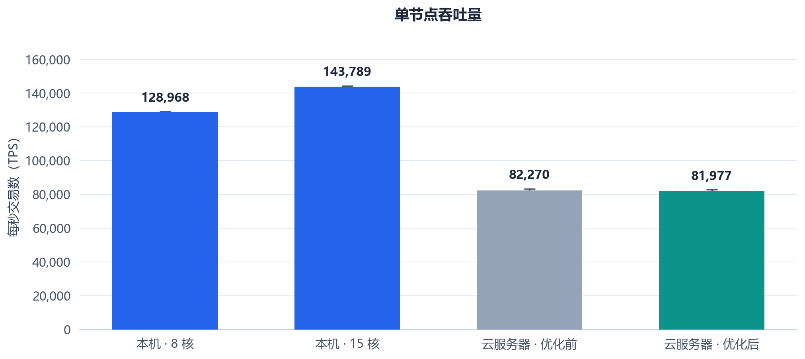
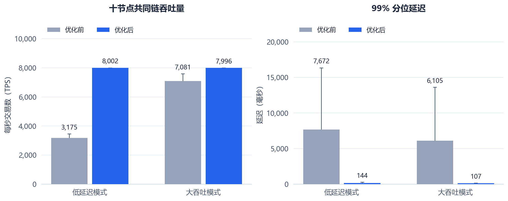
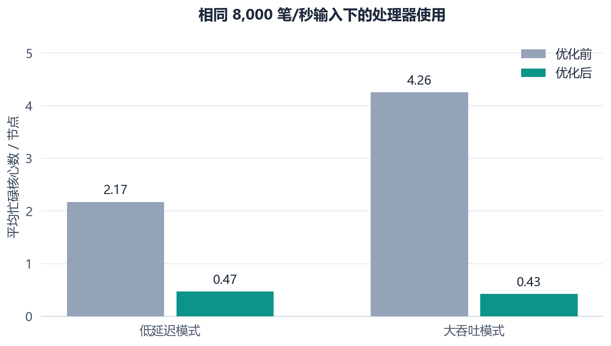
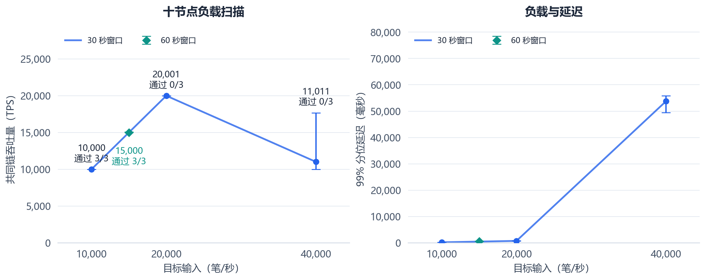

# 十节点吞吐量优化与复测

日期：2026-09-30。优化代码：`0d7071fa0c07084755ba197d654927d1442c9d6b`；对照代码：`8cf3a5fec4278fd244beb80eef0a98c753eb3d1f`。

## 主要结果

十节点本轮三次均通过持续负载判据的最高输入档位为每秒 15,000 笔。优化前对应最高档位为每秒 5,000 笔；通过档位提高 200%。
本机单节点复测中位数为每秒 128,968 笔（8 个物理核心）和 143,789 笔（15 个物理核心）。云服务器单节点约每秒 82,000 笔。
十节点默认参数短时扫描达到每秒 40,484 笔，测量窗口为 12 秒；高负载的持续性、分叉与状态核对结果分组列于下文。

## 代码修改

1. 相同区块先比较完整内容，已落盘区块和已有候选直接结束处理。
2. 缓存近期通过验签的完整内容摘要，覆盖交易签名及全部合约输入。缓存分为 16 个桶，每桶最多 8,192 条，合计 131,072 条。余额和序号继续按当前分支检查。
3. 分叉切换后，在原交易池中按新账户状态筛选交易，重建序号索引与就绪计数。退出主链的交易经过正常入池检查恢复。
4. 增加实际验签次数、验签缓存命中、重复区块数和交易池刷新耗时，便于后续定位。

Windows 与 Ubuntu 上的八项回归全部通过，新增检查覆盖缓存后的交易篡改、合约输入和创世摘要绑定、分叉后余额变化、就绪交易与合约输入计数。

## 测量方法

交易为 176 字节原生转账，1,024 个账户，开启同步落盘。十台 Ubuntu 24.04.4 服务器，处理器识别为 AMD EPYC 9K85，每台 8 个逻辑核心、16 GiB 内存，使用内网全连接。每节点 4 个网络线程和 8 个验签线程。
本轮吞吐量测量使用原生转账。以太坊虚拟机（Ethereum Virtual Machine，EVM）合约路径通过功能回归；合约吞吐量需使用相应调用负载单独测量。
每秒交易数（Transactions Per Second，TPS）采用十节点已落盘共同链前缀的增长速度。延迟从计划产生交易开始，包含发送、排队与采样；轮询间隔 10 毫秒。每个用例使用新数据库并核对全节点链头、账户余额、序号与唯一交易总量。
持续负载沿用原判据：实际发送与共同链速度均达到输入的 95%，交易拒绝与非法计数为零，全部延迟样本完成，最终状态核对通过，十节点排队副本总量增长斜率不超过每秒 10 笔。

吞吐量与延迟表采用重复实验中位数；图中的误差线为实际最小值至最大值。内存单位 GiB、MiB 分别为吉比字节（Gibibyte）、兆比字节（Mebibyte），流量单位 MB 为兆字节（Megabyte）。

## 单节点对照

本机采用 Intel Core i7-13700，按照原核心映射预留一个性能核心给发送端，每轮 300,000 笔，重复三次。8 核组合为 7 个性能核与 1 个能效核，15 核组合为 7 个性能核与 8 个能效核。服务器采用同一台机器、同一发送端和同一份 280,000 笔签名数据，新旧版本交替运行三次。下表计时覆盖发送端启动至全部提交完成。

| 环境 | 核心数 | 吞吐量中位数（笔/秒） |
|---|---:|---:|
| 本机，优化后 | 8 个物理核心 | 128,968 |
| 本机，优化后 | 15 个物理核心 | 143,789 |
| 云服务器，优化前 | 8 个逻辑核心 | 82,270 |
| 云服务器，优化后 | 8 个逻辑核心 | 81,977 |

服务器单节点变化为 -0.36%。本机单节点十多万笔的结果在本次复测中得到复现。



## 十节点相同负载对照

输入固定每秒 8,000 笔，直接复用原实验的签名数据。两种模式各重复三次，预热 5 秒、测量 30 秒，最多等待 45 秒清空积压。低延迟模式等待 10 毫秒、最多 512 笔一块；大吞吐模式等待 50 毫秒、最多 6,000 笔一块。

优化前：

| 模式 | 输入（笔/秒） | 共同链吞吐量（笔/秒） | 99% 分位延迟（毫秒） | 持续负载通过 | 状态核对通过 |
|---|---:|---:|---:|---:|---:|
| 低延迟 | 8,000 | 3,175.0 | 7,672.4 | 0/3 | 0/3 |
| 大吞吐 | 8,000 | 7,080.6 | 6,105.1 | 0/3 | 3/3 |

优化后：

| 模式 | 输入（笔/秒） | 共同链吞吐量（笔/秒） | 99% 分位延迟（毫秒） | 持续负载通过 | 状态核对通过 |
|---|---:|---:|---:|---:|---:|
| 低延迟 | 8,000 | 8,002.3 | 144.5 | 3/3 | 3/3 |
| 大吞吐 | 8,000 | 7,995.6 | 107.5 | 3/3 | 3/3 |



## 资源变化

中央处理器（Central Processing Unit，CPU）使用量根据进程消耗的处理器时间计算，1 表示平均占满一个逻辑核心。下表固定每秒 8,000 笔输入，取十节点与三次重复的中位数。区块验证耗时取测量窗口内的累计墙钟计时增量，多线程计时可以重叠。

| 模式 | 版本 | 平均忙碌核心数 / 节点 | 区块验证累计毫秒 / 秒 |
|---|---|---:|---:|
| 低延迟 | 优化前 | 2.173 | 1,337.73 |
| 低延迟 | 优化后 | 0.470 | 3.84 |
| 大吞吐 | 优化前 | 4.259 | 3,873.27 |
| 大吞吐 | 优化后 | 0.426 | 2.51 |

优化减少了重复区块的解析和验签，也减少了分叉时的交易池复制与重复验签。十节点每笔交易经历多个节点的校验、传播和候选竞争，吞吐量还取决于分支收敛速度。




## 默认参数短时扫描

预热 3 秒、测量 12 秒、清空积压等待上限 30 秒；每档计划重复 1 次。

| 模式 | 输入（笔/秒） | 共同链吞吐量（笔/秒） | 99% 分位延迟（毫秒） | 持续负载通过 | 状态核对通过 |
|---|---:|---:|---:|---:|---:|
| 低延迟 | 5,000 | 5,004.8 | 46.2 | 0/1 | 1/1 |
| 低延迟 | 8,000 | 7,994.4 | 204.4 | 1/1 | 1/1 |
| 低延迟 | 10,000 | 10,000.8 | 81.8 | 1/1 | 1/1 |
| 低延迟 | 20,000 | 19,511.8 | 399.0 | 0/1 | 1/1 |
| 低延迟 | 40,000 | 40,484.1 | 787.1 | 0/1 | 1/1 |
| 大吞吐 | 5,000 | 4,995.1 | 91.0 | 1/1 | 1/1 |
| 大吞吐 | 8,000 | 8,007.6 | 132.9 | 0/1 | 1/1 |
| 大吞吐 | 10,000 | 9,992.2 | 223.0 | 0/1 | 1/1 |
| 大吞吐 | 20,000 | 19,908.0 | 1,321.5 | 0/1 | 1/1 |
| 大吞吐 | 40,000 | 31,154.6 | 10,033.7 | 0/1 | 1/1 |

## 默认参数过载扫描

预热 3 秒、测量 12 秒、清空积压等待上限 30 秒；每档计划重复 1 次。

| 模式 | 输入（笔/秒） | 共同链吞吐量（笔/秒） | 99% 分位延迟（毫秒） | 持续负载通过 | 状态核对通过 |
|---|---:|---:|---:|---:|---:|
| 低延迟 | 60,000 | 6,282.0 | 37,356.5 | 0/1 | 0/1 |

每秒 60,000 笔用例出现发送阻塞、交易池溢出和共同链未收敛。随后停止更高档位扫描；160,000 笔用例中止，100,000 笔用例未运行。中止用例单独保留清理记录。

## 默认参数重复实验

预热 5 秒、测量 30 秒、清空积压等待上限 45 秒；每档计划重复 3 次。

| 模式 | 输入（笔/秒） | 共同链吞吐量（笔/秒） | 99% 分位延迟（毫秒） | 持续负载通过 | 状态核对通过 |
|---|---:|---:|---:|---:|---:|
| 低延迟 | 10,000 | 10,000.1 | 192.3 | 3/3 | 3/3 |
| 低延迟 | 20,000 | 20,000.8 | 724.3 | 0/3 | 3/3 |
| 低延迟 | 40,000 | 11,011.1 | 53,790.4 | 0/3 | 0/3 |



## 20 毫秒轮次参数扫描

预热 5 秒、测量 15 秒、清空积压等待上限 30 秒；每档计划重复 1 次。

开启现有四时间戳时钟校正，轮次间隔 20 毫秒，候选收集窗口为默认的 5 毫秒，区块上限 6,000 笔。同父块继续按交易数、哈希排序，分支继续按累计交易数、高度和哈希排序。

| 模式 | 输入（笔/秒） | 共同链吞吐量（笔/秒） | 99% 分位延迟（毫秒） | 持续负载通过 | 状态核对通过 |
|---|---:|---:|---:|---:|---:|
| 大吞吐 | 20,000 | 20,107.5 | 1,565.3 | 0/1 | 1/1 |
| 大吞吐 | 40,000 | 5,992.8 | 8,096.3 | 0/1 | 0/1 |
| 大吞吐 | 60,000 | 2,037.4 | 未完成 | 0/1 | 0/1 |

该组在每秒 20,000 笔输入下的分支切换最大深度达到 20；40,000 和 60,000 笔档位最终状态核对未通过。后续使用默认出块参数，轮次长度与候选窗口继续作为独立研究参数。

## 持续负载补充验证

预热 10 秒、测量 60 秒、清空积压等待上限 45 秒；每档计划重复 3 次。

| 模式 | 输入（笔/秒） | 共同链吞吐量（笔/秒） | 99% 分位延迟（毫秒） | 持续负载通过 | 状态核对通过 |
|---|---:|---:|---:|---:|---:|
| 低延迟 | 15,000 | 15,000.3 | 579.8 | 3/3 | 3/3 |

过载用例的延迟统计取已完成抽样；未完成抽样数量、实际发送速率和拒绝计数保存在 `RESULTS.json`。拒绝与非法计数累加十节点处理的交易副本，同一交易可能贡献多次计数。短窗口内的共同链增长可能包含窗口开始前的积压交易。

## 高负载资源与分叉

下表取各档全部重复中的最大资源读数，重组次数为十节点合计的中位数。网络流量使用节点协议计数器。

| 输入（笔/秒） | 平均忙碌核心数最大值 | 驻留内存峰值（MiB） | 发送流量最大值（MB/秒） | 重组次数中位数 |
|---:|---:|---:|---:|---:|
| 10,000 | 0.64 / 8 | 108.4 | 18.2 | 24 |
| 20,000 | 1.57 / 8 | 175.7 | 39.9 | 5,472 |
| 40,000 | 3.35 / 8 | 344.7 | 57.9 | 2,159 |

高负载下仍有处理器和内存余量，共同链停滞伴随频繁分叉与较大的节点高度差。下一步优先处理追赶、分叉收敛与候选传播，再结合线程和存储采样定位串行等待。


## 离线恢复复测

每秒 1,000 笔输入，测量第 8 秒停止末尾节点，2 秒后重启，等待上限沿用原实验。恢复时间从发起重启开始，取连续三次链头一致中的首次观测。

| 重复 | 恢复时间（秒） | 最终状态核对 |
|---:|---:|---|
| 1 | 2.383 | 通过 |
| 2 | 2.388 | 通过 |
| 3 | 2.332 | 通过 |

相同低负载离线用例由优化前 0/3 次通过变为本轮 3/3 次通过。高负载下超过分支恢复窗口的追赶仍是后续优化项。

## 后续优化入口

1. 优先完善落后节点的追赶与出块协调，以及超过 256 块窗口的分支恢复。高输入下同时观察共同链增长、分支距离、重组次数与积压，避免分叉扩大后持续重放。
2. 继续减少重复候选广播及完整区块传输，测量网络线程的串行等待。每节点先对候选做已有的完整内容复用，再评估区块摘要与缺失交易补传。
3. 在收敛稳定后测试更长负载窗口和更高输入，并将发送器分布到独立机器。配合线程采样、磁盘等待与网卡计数，区分单线程、存储和网络限制。

## 复现与保存

完整原始数据保存在服务器 `/home/ubuntu/chain/results/20260930-opt-*`；每个节点的独立数据库保存在 `/home/ubuntu/chain/node-results/`。本地摘要与日志保存在 `bench-results/cloud-20260930-opt/`。
本次发布目录为 `/home/ubuntu/chain/releases/2026-09-30-tps-opt-01`，二进制摘要见 `BUILD_MANIFEST.json`。十台机器的本轮实验进程已退出，最终检查记录保存在本地原始数据的 `reproduce/final-opt-state.json`。

相同负载对照与高负载重复实验分别使用以下命令，每次修改输出目录：

```bash
/home/ubuntu/chain/releases/2026-09-30-d4106d1/.venv/bin/python /home/ubuntu/chain/run_cloud_opt.py --plan /home/ubuntu/chain/opt-compare.json --work /home/ubuntu/chain/results/tps-compare-02 --suite throughput --dataset /home/ubuntu/chain/results/20260930-baseline-01/transactions.bin
/home/ubuntu/chain/releases/2026-09-30-d4106d1/.venv/bin/python /home/ubuntu/chain/run_cloud_opt.py --plan /home/ubuntu/chain/opt-repeat.json --work /home/ubuntu/chain/results/tps-repeat-02 --suite throughput --dataset /home/ubuntu/chain/results/20260930-opt-ceiling-01/transactions.bin --mode latency
```

计划文件保存在本报告的 `plans/` 中。控制机运行脚本、数据集摘要和完整构建日志同时归档于本地原始数据目录。
